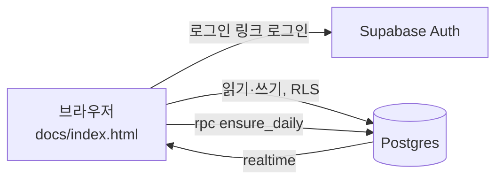
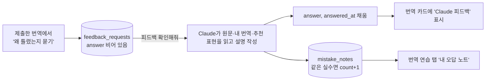

# Root & Register (뿌리와 결)

통번역사와 카피라이터가 함께 쓰는 어원·격(사용역) 학습 웹앱이에요. 두 사람이 서로 가르치면서 배우는 6개월(12회) 공동 학습 프로그램을 도와요.

- **오늘의 문장** (첫 화면): 하루 한 문장, 영어만 먼저 보여 줘요. 누르면 한글 뜻, 설명, 어려운 단어 풀이가 펼쳐져요. 두 사람이 같은 문장을 봐요.
- **번역 연습**: 매일 하는 짧은 문장 연습이에요(하루 1~2문장 권장). 방향은 한→영, 영→한 두 가지이고 주제는 마케팅·광고, 비즈니스·이메일, 일상 회화, 여행 표현이에요(방향마다 24문장). 처음 열면 희주는 한→영, 혜림은 영→한이 보여요(`members.drill_dir`). 내가 제출해야 상대 번역이 보이고(블라인드), 내가 제출하면 추천 표현과 포인트가 열려요. 번역 연습 코멘트는 그 문장을 제출한 사람에게만 보여요(스포 방지). 제출한 번역에 **왜 틀렸는지 Claude에게 묻기**를 누르면 피드백 요청이 쌓이고, 자주 틀리는 표현은 **내 오답 노트**에 모여요(아래 [피드백 확인](#피드백-확인-claude가-하는-일)).
- **교차번역** (예전 이름: 세션 기록 → 함께 번역): 2주에 한 번 모임용 원문을 각자 블라인드로 번역하고, 모임에서 비교해 합의안과 메모를 적어요. 원문마다 난이도(쉬움·보통·실전)가 있어요. 내 번역을 저장하면 추천 표현이 열리고, 번역 연습처럼 Claude 피드백을 요청할 수 있어요.
- **오늘의 복습**: 5단계 간격 반복 복습이에요. 진도는 사람마다 따로 저장돼요.
- **용어집**: 격·분야·언어로 필터링할 수 있어요. 영어 용어는 단어와 예문만 먼저 보여 주고, 누르면 뜻이 펼쳐져요.
- **영어 카피 연습** (구 태그라인 보드): 주마다 Claude가 넣는 가상 브랜드 브리프에 맞춰 영어 카피를 블라인드로 제출하고 서로 피드백해요. 브리프 없이 쓰는 자유 카피도 올릴 수 있어요.
- **즐겨찾기(★)와 코멘트**: 용어, 세션, 태그라인, 오늘의 문장마다 달 수 있어요. 즐겨찾기는 사람마다 따로 저장되고, 목록마다 "즐겨찾기만 보기"가 있어요.
- **건의함**: 앱을 어떻게 바꾸고 싶은지 올리는 게시판이에요. Claude Code 세션에서 "건의함 확인해줘"라고 하면 Claude가 새 건의를 읽고 요약해 줘요. 희주 님이 승인하면 반영하고, 상태와 처리 메모를 달아요. 상태와 메모는 앱에서 바꿀 수 없고 Claude만 SQL로 갱신해요.
- **이름 정하기**: 앱 이름 후보에 각자 여러 개 좋아요를 누르고 결과를 함께 봐요. 마음에 안 드는 후보는 빼고(둘 다에게 적용, 되살리기 가능) **다시 추천하기**로 새 후보를 받아요. 후보는 Claude가 미리 써 둔 30개이고, 다 쓰면 건의함에 새 후보 요청이 올라가요.
- **요금 없음**: 앱은 AI를 호출하지 않아요. 예문, 설명, 단어 풀이는 데이터로 미리 넣어 둬요. Vercel Hobby와 Supabase Free 플랜만 써요.

배포 주소: https://root-register.vercel.app

커리큘럼 문서: https://claude.ai/code/artifact/1c3f2a9e-ef9a-4133-a30c-5a58af927c16

## 구조

```
docs/                    정적 사이트 (Vercel이 main 브랜치의 docs/를 배포)
  index.html             앱 전체 (바닐라 JS, supabase-js UMD)
  config.js              Supabase URL + anon key (공개용 키)
supabase/
  migrations/            테이블, RLS 정책, realtime 설정
  seed.sql               예시 데이터 (용어 13개, 세션 원문 2개)
  data/                  예문 설명·단어 풀이 등 추가 데이터 SQL
  functions/examples/    사용 중지 (AI 호출 제거, 410 응답만 반환)
scripts/
  artifact-to-seed.mjs   claude.ai artifact DB에서 내보낸 JSON → seed.sql
notes/
  changelog.md           작업 기록 전체 (최신순, 목차 포함)
```



### 접근 제어

- 로그인한 이메일이 `members` 테이블에 있어야 읽고 쓸 수 있어요. RLS의 `is_member()`가 이를 검사해요.
- 복습 진도(`reviews`), 즐겨찾기(`favorites`)는 본인만 보고 고칠 수 있어요. 세션 번역(`session_versions`), 코멘트(`comments`)는 함께 보고 작성자 본인만 고칠 수 있어요.
- 번역 연습: `drill_answers`는 본인 것과, 내가 제출한 문장의 남의 답만 보여요(`drill_answered()`). `drill_models`(추천 표현)는 내가 제출한 문장만 읽을 수 있어요(`drill_answered()`). 번역 연습 코멘트(`comments`, `target_type='drill'`)도 제출한 사람과 작성자에게만 보여요. 누가 제출했는지는 본문 없이 `drill_status()`로 알려 줘요.
- 교차번역 추천 표현(`session_models`)은 내가 그 원문에 번역을 저장해야 읽을 수 있어요(`session_answered()`).
- 피드백 요청(`feedback_requests`)과 내 오답 노트(`mistake_notes`)는 본인 것만 보여요. 멤버는 요청을 올리고 지울 수만 있고, 답변(`answer`)과 오답 노트는 Claude만 SQL로 써요.
- 오늘의 문장은 `ensure_daily()`가 서울 날짜 기준으로 하루 1개를 용어집 영어 예문에서 골라 `daily_sentences`에 저장해요.
- `docs/config.js`의 anon key는 공개돼도 괜찮은 키예요. 데이터는 RLS가 막아요.

## 설정 방법

1. Supabase 프로젝트를 만들고 SQL Editor에서 `supabase/migrations/*.sql`(파일명 순서대로), `supabase/seed.sql`, `supabase/data/*.sql`을 차례로 실행해요.
2. 멤버를 등록해요. 이메일은 저장소에 넣지 않고 SQL Editor에서만 실행해요.
   ```sql
   insert into public.members (email, display_name) values
     ('나의 이메일', '이름'), ('친구 이메일', '이름');
   ```
3. Authentication → URL Configuration에서 Site URL과 Redirect URL에 배포 주소를 넣어요.
   Authentication → Hooks → **Before User Created**에 Postgres 함수 `public.hook_before_user_created`를 연결해요. 이렇게 하면 `members`에 있는 이메일만 가입할 수 있어요.
4. `docs/config.js`에 프로젝트 URL과 anon key를 넣어요.
5. Vercel에서 이 저장소를 Import하고 Root Directory를 `docs`, Framework Preset을 `Other`로 두면(빌드 명령 없음) main에 push할 때마다 자동으로 배포돼요.

### 피드백 확인 (Claude가 하는 일)

Claude Code 세션에서 "피드백 확인해줘"라고 하면 Claude가 아래 순서로 처리해요. 앱은 AI를 부르지 않아서, 답은 버튼을 누른 순간이 아니라 다음 확인 때 달려요.



- [ ] `answered_at is null`인 요청을 모두 읽어요. `target_type`이 `drill`이면 `drills`·`drill_answers`·`drill_models`, `session`이면 `sessions`·`session_versions`·`session_models`를 같이 읽어요.
- [ ] 요청마다 `answer`에 설명을 써요. 틀린 곳, 왜 어색한지, 더 나은 표현을 짧게 적어요.
- [ ] 반복될 만한 실수는 `mistake_notes`에 넣어요. 같은 사람의 같은 `wrong`이 이미 있으면 새로 넣지 않고 `count`와 `last_seen`을 올려요.
- [ ] 교차번역에 새 원문이 올라왔는데 `session_models`가 없으면 추천 표현도 써서 넣어요.

새 용어의 예문과 설명은 직접 입력하거나(`문장 | 번역` 형식), Claude Code에 부탁해 DB에 넣어요. 앱이 API를 호출하지 않으니 요금이 나오지 않아요.

## 작업 기록

전체 기록은 [notes/changelog.md](notes/changelog.md)에 최신순으로 있어요. 최근 5개:

| 날짜 | 작업 |
|---|---|
| 2026-09-26 | [건의 반영: 영→한 번역 연습, 교차번역 추천 표현, Claude 피드백, 탭 순서](notes/changelog.md#2026-09-26--건의-반영-영한-번역-연습-교차번역-추천-표현-claude-피드백-탭-순서) |
| 2026-09-25 | [메뉴를 다시 위쪽 가로 탭으로 되돌림](notes/changelog.md#2026-09-25--메뉴를-다시-위쪽-가로-탭으로-되돌림) |
| 2026-09-25 | [함께 번역 화면에서 '세션'이라는 말 없애기](notes/changelog.md#2026-09-25--함께-번역-화면에서-세션이라는-말-없애기) |
| 2026-09-25 | [건의 반영: 번역 연습 공개 조건, 함께 번역 난이도·이름](notes/changelog.md#2026-09-25--건의-반영-번역-연습-공개-조건-함께-번역-난이도이름) |
| 2026-09-25 | [작업 기록을 notes/changelog.md로 분리](notes/changelog.md#2026-09-25--작업-기록을-noteschangelogmd로-분리) |
