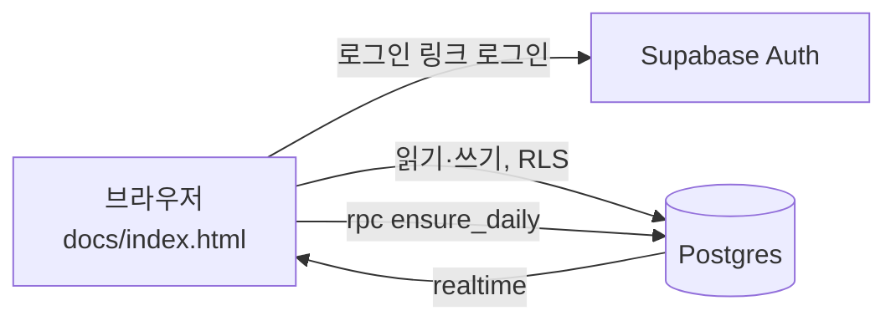

# Root & Register (뿌리와 결)

통번역사와 카피라이터가 함께 쓰는 어원·격(사용역) 학습 웹앱이에요. 두 사람이 서로 가르치면서 배우는 6개월(12회) 공동 학습 프로그램을 도와요.

- **오늘의 문장** (첫 화면): 하루 한 문장, 영어만 먼저 보여 줘요. 누르면 한글 뜻, 설명, 어려운 단어 풀이가 펼쳐져요. 두 사람이 같은 문장을 봐요.
- **오늘의 복습**: 5단계 간격 반복 복습이에요. 진도는 사람마다 따로 저장돼요.
- **용어집**: 격·분야·언어로 필터링할 수 있어요. 영어 용어는 단어와 예문만 먼저 보여 주고, 누르면 뜻이 펼쳐져요.
- **세션 기록**: 원문을 올리고 각자 번역한 뒤 합의안과 메모를 함께 적어요.
- **태그라인 보드**: 친구가 올린 영어 태그라인에 피드백해요.
- **즐겨찾기(★)와 코멘트**: 용어, 세션, 태그라인, 오늘의 문장마다 달 수 있어요. 즐겨찾기는 사람마다 따로 저장되고, 목록마다 "즐겨찾기만 보기"가 있어요.
- **요금 없음**: 앱은 AI를 호출하지 않아요. 예문, 설명, 단어 풀이는 데이터로 미리 넣어 둬요. Vercel Hobby와 Supabase Free 플랜만 써요.

배포 주소: https://root-register.vercel.app

커리큘럼 문서: https://claude.ai/code/artifact/1c3f2a9e-ef9a-4133-a30c-5a58af927c16

## 구조

```
docs/                    정적 사이트 (Vercel이 main 브랜치의 docs/를 배포)
  index.html             앱 전체 (바닐라 JS, supabase-js UMD)
  config.js              Supabase URL + anon key (공개용 키)
supabase/
  migrations/            테이블, RLS 정책, realtime 설정
  seed.sql               예시 데이터 (용어 13개, 세션 원문 2개)
  data/                  예문 설명·단어 풀이 등 추가 데이터 SQL
  functions/examples/    사용 중지 (AI 호출 제거, 410 응답만 반환)
scripts/
  artifact-to-seed.mjs   claude.ai artifact DB에서 내보낸 JSON → seed.sql
```



### 접근 제어

- 로그인한 이메일이 `members` 테이블에 있어야 읽고 쓸 수 있어요. RLS의 `is_member()`가 이를 검사해요.
- 복습 진도(`reviews`), 즐겨찾기(`favorites`)는 본인만 보고 고칠 수 있어요. 세션 번역(`session_versions`), 코멘트(`comments`)는 함께 보고 작성자 본인만 고칠 수 있어요.
- 오늘의 문장은 `ensure_daily()`가 서울 날짜 기준으로 하루 1개를 용어집 영어 예문에서 골라 `daily_sentences`에 저장해요.
- `docs/config.js`의 anon key는 공개돼도 괜찮은 키예요. 데이터는 RLS가 막아요.

## 설정 방법

1. Supabase 프로젝트를 만들고 SQL Editor에서 `supabase/migrations/*.sql`(파일명 순서대로), `supabase/seed.sql`, `supabase/data/*.sql`을 차례로 실행해요.
2. 멤버를 등록해요. 이메일은 저장소에 넣지 않고 SQL Editor에서만 실행해요.
   ```sql
   insert into public.members (email, display_name) values
     ('나의 이메일', '이름'), ('친구 이메일', '이름');
   ```
3. Authentication → URL Configuration에서 Site URL과 Redirect URL에 배포 주소를 넣어요.
4. `docs/config.js`에 프로젝트 URL과 anon key를 넣어요.
5. Vercel에서 이 저장소를 Import하고 Root Directory를 `docs`, Framework Preset을 `Other`로 두면(빌드 명령 없음) main에 push할 때마다 자동으로 배포돼요.

새 용어의 예문과 설명은 직접 입력하거나(`문장 | 번역` 형식), Claude Code에 부탁해 DB에 넣어요. 앱이 API를 호출하지 않으니 요금이 나오지 않아요.

## 작업 기록

변경할 때마다 아래에 날짜순으로 추가해요.

### 2026-09-25 · 프로그램 설계와 artifact 프로토타입
- 두 사람의 프로필을 바탕으로 2주 1회 공동 세션과 개인 학습을 합친 6개월 커리큘럼을 설계하고 Claude Docs 문서로 만들었어요.
- claude.ai artifact로 첫 앱을 만들었어요. artifact DB, 사용자 식별, 예문 생성(sample) 기능을 썼어요.
- 예시 데이터를 넣었어요. 어근 짝 8개, 용어 10개, 세션 1 원문 2개예요.
- 뜻 보기에 예문 3~5개와 번역이 나오게 했고, 부족하면 자동 생성하게 했어요.
- register 비교표(get → receive → obtain 등)를 용어집에 추가했어요. obtain, ascertain, numerous는 새로 넣고, 검토하다와 보류하다는 대응 표현을 3단계로 바꿨어요.
- 용어집의 영어 용어는 단어와 영어 예문만 먼저 보이고, 누르면 뜻이 펼쳐지게 했어요.

### 2026-09-25 · 웹사이트 배포 준비
- 새 저장소를 만들었어요. 배포 구조는 GitHub Pages(정적 사이트)와 Supabase(Auth, Postgres, Realtime, Edge Function)로 정했어요.
- artifact 전용 API(`window.claude` db/user/sample)를 supabase-js로 바꿨어요.
  - 로그인은 이메일 로그인 링크 방식이고, `members` 테이블에 있는 사람만 들어올 수 있어요.
  - 다른 사람이 수정한 내용은 realtime 구독으로 바로 반영돼요.
  - 예문 생성은 Edge Function `examples`가 맡아요. Claude API 키는 서버 secret에만 저장해요.
- artifact DB 데이터(용어 13개, 어근 짝 8개, 세션 2개)를 내보내서 `seed.sql`로 옮겼어요.
- GitHub Actions 워크플로 대신 main 브랜치의 `/docs` 폴더를 Pages로 배포하게 바꿨어요. 로그인 토큰에 workflow 권한이 없어서 워크플로 파일을 push할 수 없었어요.
- GitHub 무료 플랜에서는 비공개 저장소에 Pages를 켤 수 없어서(HTTP 422) 호스팅을 Vercel로 바꿨어요. 저장소는 Private로 유지해요.
- Supabase 프로젝트는 claude.ai Supabase 커넥터로 만들기로 했어요.

### 2026-09-25 · Vercel 배포
- Vercel CLI로 로그인한 뒤 `root-register` 프로젝트를 만들었어요. Root Directory는 `docs`, Framework는 없음으로 설정했어요.
- 첫 프로덕션 배포를 했어요: https://root-register.vercel.app
- 아직 Supabase를 연결하지 않아서, 사이트는 열리지만 설정 안내 화면이 보여요.
- `vercel git connect`는 실패했어요. Vercel GitHub 앱이 이 비공개 저장소에 접근할 권한이 없어서예요. 권한을 주기 전까지는 `npx vercel deploy --prod`로 직접 배포해요.

### 2026-09-25 · Supabase 연결
- claude.ai Supabase 커넥터로 `root-register` 프로젝트를 만들었어요(서울 `ap-northeast-2`, ref `djhrnlatrtrfmmcjekqk`).
- 초기 마이그레이션과 예시 데이터를 넣었어요. 용어 13개(예문 52개), 어근 짝 8개, 세션 원문 2개예요.
- 소유자 이메일 1개를 `members`에 등록했어요. 이메일은 DB에만 있고 저장소에는 없어요.
- 보안 점검(advisor) 경고 3건을 처리했어요(`20260925010000_harden_functions.sql`).
  - `me()`의 search_path를 고정했어요.
  - 로그인하지 않은 사용자(anon)의 `is_member()` 실행 권한을 회수했어요.
  - authenticated 사용자의 `is_member()` 경고는 RLS 정책에 꼭 필요한 권한이라 그대로 뒀어요.
- Edge Function `examples`를 배포했어요(JWT 검증 사용). `ANTHROPIC_API_KEY` secret은 아직 넣지 않았어요.
- `docs/config.js`에 프로젝트 URL과 공개용(publishable) 키를 넣고 Vercel에 다시 배포했어요.
- 로그인하지 않은 상태로 확인한 결과:
  - `terms` 조회는 빈 배열이 돌아와요(RLS 차단).
  - `rpc/is_member`는 권한 거부가 나요.
  - `examples` 함수는 401이 돌아와요.
- 남은 설정: Auth URL Configuration(Site URL, Redirect URL).
- 사용자가 Anthropic Console에서 API 키를 만들어 Supabase Edge Function secret `ANTHROPIC_API_KEY`로 등록했어요. 키는 저장소와 대화에 남기지 않았어요.
- 멤버 2명(통번역사, 카피라이터)을 표시 이름과 함께 `members`에 등록했어요. 이메일은 DB에만 있어요.

### 2026-09-25 · 오늘의 문장, 즐겨찾기·코멘트, 어근 짝 삭제, AI 호출 제거
- 요청: 목록마다 코멘트·즐겨찾기, 어근 짝 삭제, 첫 화면을 오늘의 문장으로. 도중에 "요금이 절대 안 나오게"라는 요청이 추가됐어요.
- 마이그레이션 `20260925020000_comments_favorites_daily.sql`
  - `comments`: 범용 코멘트. 기존 `tagline_comments`를 옮긴 뒤 삭제했어요.
  - `favorites`: 사람마다 따로 저장해요.
  - `daily_sentences`와 `ensure_daily()`: 서울 날짜 기준 하루 1개. 최근 30일에 안 쓴 영어 예문 중 설명이 있는 것을 우선으로 골라요.
  - `roots` 테이블과 `terms.root_id`를 삭제했어요. 예시 어근 짝 8개는 git 기록에 남아 있어요.
- 요금이 나오지 않게 AI 호출을 모두 없앴어요.
  - `examples` Edge Function은 410만 돌려주는 빈 함수로 바꿨어요.
  - 앱의 예문 자동 생성 버튼을 없앴어요.
  - 영어 예문 36개의 설명과 어려운 단어 풀이는 Claude Code가 직접 써서 넣었어요(`supabase/data/20260925_example_notes.sql`).
  - Anthropic API 키는 이제 필요 없어요. Supabase secret과 Console의 키를 지우면 요금이 나갈 길이 완전히 없어져요.
- 화면: 첫 탭을 `오늘의 문장`으로 바꾸고 `어근 짝` 탭을 없앴어요.
  - 별(★)과 접이식 코멘트를 용어, 세션, 태그라인, 오늘의 문장에 달았어요. 복습 카드에는 별만 달았어요.
  - 목록마다 "즐겨찾기만 보기"를 넣었어요.
  - 용어 추가 폼은 `문장 | 번역` 형식을 받아요.
- 검증
  - 롤백 트랜잭션에서 멤버 권한으로 `ensure_daily()`를 호출해 설명과 단어 2개가 붙은 문장이 나오는 걸 확인했어요.
  - 멤버가 아닌 계정으로는 `daily_sentences`, `terms`가 0건으로 보였어요.
  - 즐겨찾기와 코멘트 insert가 되고 author가 본인 이메일로 채워지는 것도 확인했어요.
  - 보안 점검: 남은 경고는 의도한 `is_member()` 권한과, 로그인 링크 방식이라 해당 없는 비밀번호 유출 검사뿐이에요.
