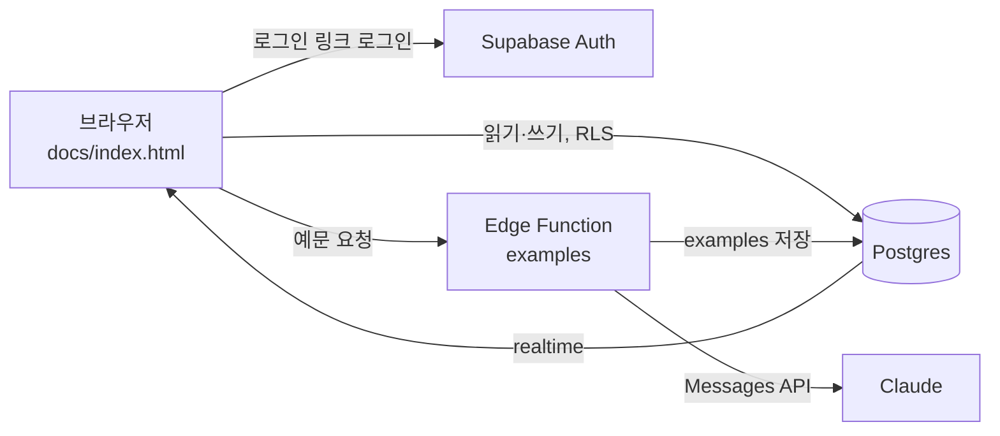

# Root & Register (뿌리와 결)

통번역사와 카피라이터가 함께 쓰는 어원·격(사용역) 학습 웹앱이에요. 두 사람이 서로 가르치면서 배우는 6개월(12회) 공동 학습 프로그램을 도와요.

- **오늘의 복습**: 5단계 간격 반복 복습이에요. 진도는 사람마다 따로 저장돼요.
- **용어집**: 격·분야·언어로 필터링할 수 있어요. 영어 용어는 단어와 예문만 먼저 보여 주고, 누르면 뜻이 펼쳐져요.
- **예문**: 용어마다 3~5개가 번역과 함께 붙어요. 부족하면 Claude가 만들어서 저장해요.
- **어근 짝**: 영어 어근과 한자 어근을 짝지어 보여 줘요. 예: *spir-* ↔ 氣
- **세션 기록**: 원문을 올리고 각자 번역한 뒤 합의안과 메모를 함께 적어요.
- **태그라인 보드**: 친구가 올린 영어 태그라인에 코멘트로 피드백해요.

배포 주소: https://root-register.vercel.app

커리큘럼 문서: https://claude.ai/code/artifact/1c3f2a9e-ef9a-4133-a30c-5a58af927c16

## 구조

```
docs/                    정적 사이트 (Vercel이 main 브랜치의 docs/를 배포)
  index.html             앱 전체 (바닐라 JS, supabase-js UMD)
  config.js              Supabase URL + anon key (공개용 키)
supabase/
  migrations/            테이블, RLS 정책, realtime 설정
  seed.sql               예시 데이터 (어근 짝 8개, 용어 13개, 세션 원문 2개)
  functions/examples/    예문 생성 Edge Function (Claude API)
scripts/
  artifact-to-seed.mjs   claude.ai artifact DB에서 내보낸 JSON → seed.sql
```



### 접근 제어

- 로그인한 이메일이 `members` 테이블에 있어야 읽고 쓸 수 있어요. RLS의 `is_member()`가 이를 검사해요.
- 복습 진도(`reviews`), 세션 번역(`session_versions`), 태그라인 코멘트(`tagline_comments`)는 작성자 본인만 고칠 수 있어요.
- `docs/config.js`의 anon key는 공개돼도 괜찮은 키예요. 데이터는 RLS가 막아요.

## 설정 방법

1. Supabase 프로젝트를 만들고 SQL Editor에서 `supabase/migrations/*.sql`, `supabase/seed.sql`을 차례로 실행해요.
2. 멤버를 등록해요. 이메일은 저장소에 넣지 않고 SQL Editor에서만 실행해요.
   ```sql
   insert into public.members (email, display_name) values
     ('나의 이메일', '이름'), ('친구 이메일', '이름');
   ```
3. Authentication → URL Configuration에서 Site URL과 Redirect URL에 배포 주소를 넣어요.
4. Edge Function을 배포해요.
   ```sh
   supabase secrets set ANTHROPIC_API_KEY=sk-ant-...
   supabase functions deploy examples
   ```
5. `docs/config.js`에 프로젝트 URL과 anon key를 넣어요.
6. Vercel에서 이 저장소를 Import하고 Root Directory를 `docs`, Framework Preset을 `Other`로 두면(빌드 명령 없음) main에 push할 때마다 자동으로 배포돼요.

예문 생성에는 `claude-opus-5`를 effort `low`로 써요. 거절 응답이 나오면 서버 측 `fallbacks: "default"`가 다른 모델로 한 번 더 시도해요. 호출할 때마다 API 요금이 나와요.

## 작업 기록

변경할 때마다 아래에 날짜순으로 추가해요.

### 2026-09-25 · 프로그램 설계와 artifact 프로토타입
- 두 사람의 프로필을 바탕으로 2주 1회 공동 세션과 개인 학습을 합친 6개월 커리큘럼을 설계하고 Claude Docs 문서로 만들었어요.
- claude.ai artifact로 첫 앱을 만들었어요. artifact DB, 사용자 식별, 예문 생성(sample) 기능을 썼어요.
- 예시 데이터를 넣었어요. 어근 짝 8개, 용어 10개, 세션 1 원문 2개예요.
- 뜻 보기에 예문 3~5개와 번역이 나오게 했고, 부족하면 자동 생성하게 했어요.
- register 비교표(get → receive → obtain 등)를 용어집에 추가했어요. obtain, ascertain, numerous는 새로 넣고, 검토하다와 보류하다는 대응 표현을 3단계로 바꿨어요.
- 용어집의 영어 용어는 단어와 영어 예문만 먼저 보이고, 누르면 뜻이 펼쳐지게 했어요.

### 2026-09-25 · 웹사이트 배포 준비
- 새 저장소를 만들었어요. 배포 구조는 GitHub Pages(정적 사이트)와 Supabase(Auth, Postgres, Realtime, Edge Function)로 정했어요.
- artifact 전용 API(`window.claude` db/user/sample)를 supabase-js로 바꿨어요.
  - 로그인은 이메일 로그인 링크 방식이고, `members` 테이블에 있는 사람만 들어올 수 있어요.
  - 다른 사람이 수정한 내용은 realtime 구독으로 바로 반영돼요.
  - 예문 생성은 Edge Function `examples`가 맡아요. Claude API 키는 서버 secret에만 저장해요.
- artifact DB 데이터(용어 13개, 어근 짝 8개, 세션 2개)를 내보내서 `seed.sql`로 옮겼어요.
- GitHub Actions 워크플로 대신 main 브랜치의 `/docs` 폴더를 Pages로 배포하게 바꿨어요. 로그인 토큰에 workflow 권한이 없어서 워크플로 파일을 push할 수 없었어요.
- GitHub 무료 플랜에서는 비공개 저장소에 Pages를 켤 수 없어서(HTTP 422) 호스팅을 Vercel로 바꿨어요. 저장소는 Private로 유지해요.
- Supabase 프로젝트는 claude.ai Supabase 커넥터로 만들기로 했어요.

### 2026-09-25 · Vercel 배포
- Vercel CLI로 로그인한 뒤 `root-register` 프로젝트를 만들었어요. Root Directory는 `docs`, Framework는 없음으로 설정했어요.
- 첫 프로덕션 배포를 했어요: https://root-register.vercel.app
- 아직 Supabase를 연결하지 않아서, 사이트는 열리지만 설정 안내 화면이 보여요.
- `vercel git connect`는 실패했어요. Vercel GitHub 앱이 이 비공개 저장소에 접근할 권한이 없어서예요. 권한을 주기 전까지는 `npx vercel deploy --prod`로 직접 배포해요.
