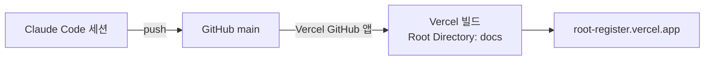
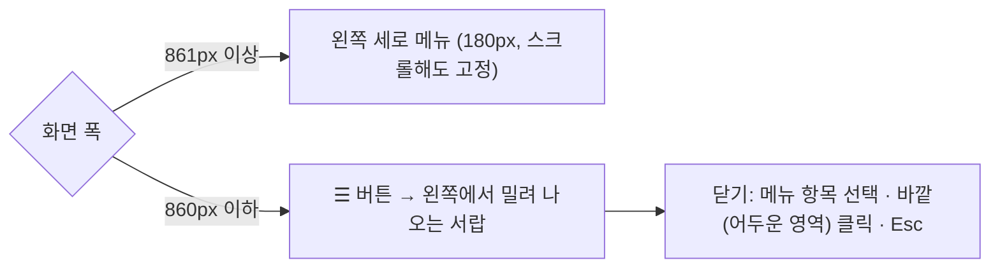

# 작업 기록

Root & Register에서 한 일을 **최신순**으로 적어요. 무엇을 했는지와 함께 왜 그렇게 했는지도 남겨요.

[← README로 돌아가기](../README.md)

## 목차

| 날짜 | 작업 |
|---|---|
| 2026-09-25 | [작업 기록을 notes/changelog.md로 분리](#2026-09-25--작업-기록을-noteschangelogmd로-분리) |
| 2026-09-25 | [Vercel과 GitHub 연결 (자동 배포)](#2026-09-25--vercel과-github-연결-자동-배포) |
| 2026-09-25 | [메뉴를 좌측 상단으로, 모바일은 햄버거 버튼](#2026-09-25--메뉴를-좌측-상단으로-모바일은-햄버거-버튼) |
| 2026-09-25 | [세션 기록 사용법 안내](#2026-09-25--세션-기록-사용법-안내) |
| 2026-09-25 | [건의함 안내를 항상 접힌 상태로](#2026-09-25--건의함-안내를-항상-접힌-상태로) |
| 2026-09-25 | [건의함 사용법 안내](#2026-09-25--건의함-사용법-안내) |
| 2026-09-25 | [탭 주소에서 `#` 없애기](#2026-09-25--탭-주소에서--없애기) |
| 2026-09-25 | [건의함](#2026-09-25--건의함) |
| 2026-09-25 | [탭별 주소, 새 디자인(폰트·색)](#2026-09-25--탭별-주소-새-디자인폰트색) |
| 2026-09-25 | [예문·추천 표현 팩트체크 (웹 리서치)](#2026-09-25--예문추천-표현-팩트체크-웹-리서치) |
| 2026-09-25 | [탭이 열리지 않던 버그 수정](#2026-09-25--탭이-열리지-않던-버그-수정) |
| 2026-09-25 | [이미 가입된 이메일로 회원가입할 때 안내](#2026-09-25--이미-가입된-이메일로-회원가입할-때-안내) |
| 2026-09-25 | [로그인·회원가입 화면 정리](#2026-09-25--로그인회원가입-화면-정리) |
| 2026-09-25 | [로그인을 이메일·비밀번호로 변경, 가입 허용 목록](#2026-09-25--로그인을-이메일비밀번호로-변경-가입-허용-목록) |
| 2026-09-25 | [번역 연습 (블라인드 제출, 추천 표현)](#2026-09-25--번역-연습-블라인드-제출-추천-표현) |
| 2026-09-25 | [오늘의 문장, 즐겨찾기·코멘트, 어근 짝 삭제, AI 호출 제거](#2026-09-25--오늘의-문장-즐겨찾기코멘트-어근-짝-삭제-ai-호출-제거) |
| 2026-09-25 | [Supabase 연결](#2026-09-25--supabase-연결) |
| 2026-09-25 | [Vercel 배포](#2026-09-25--vercel-배포) |
| 2026-09-25 | [웹사이트 배포 준비](#2026-09-25--웹사이트-배포-준비) |
| 2026-09-25 | [프로그램 설계와 artifact 프로토타입](#2026-09-25--프로그램-설계와-artifact-프로토타입) |

## 2026-09-25 · 작업 기록을 notes/changelog.md로 분리
- 문제: README에 작업 기록이 계속 쌓여 280줄이 넘었어요. 앱 소개나 설정 방법을 찾기 어려웠어요.
- 결정: 작업 기록 전체를 `notes/changelog.md`로 옮겼어요. 최신순으로 적고, 맨 위에 목차 표를 둬요. README에는 최근 5개와 링크만 남겨요.

| 방법 | 결과 | 이유 |
|---|---|---|
| GitHub Wiki | 안 씀 | 무료 플랜에서는 비공개 저장소에 Wiki를 쓸 수 없어요. Wiki는 별도 저장소라 코드와 같은 커밋에 기록을 남길 수도 없어요. |
| `docs/` 폴더 | 안 씀 | `docs/`는 Vercel이 배포하는 사이트 폴더예요. 여기 두면 작업 기록이 `root-register.vercel.app`에서 공개돼요. |
| `notes/changelog.md` | **채택** | 코드와 같은 커밋에 기록되고, GitHub에서 목차 링크로 바로 이동할 수 있어요. 배포에는 포함되지 않아요. |

- 앞으로: 새 기록은 `notes/changelog.md`의 목차 표 맨 위와 본문 맨 위에 추가해요. README의 "최근 5개" 표도 함께 갱신해요.

## 2026-09-25 · Vercel과 GitHub 연결 (자동 배포)
- 문제: 메뉴 변경을 `main`에 올렸는데 사이트가 바뀌지 않았어요. 처음 배포할 때 `vercel git connect`가 실패해서 Vercel이 GitHub와 연결되지 않은 상태였어요. 그동안은 `npx vercel deploy --prod`로 직접 배포할 때만 사이트가 바뀌었어요.
- 해결: 희주 님이 Vercel 프로젝트 설정(Settings → Git)에서 `gooseybee/root-register`를 연결했어요.
- 이제 흐름은 이래요.

- 헷갈리기 쉬운 점: GitHub의 **Authorized GitHub Apps**는 로그인 권한 목록이라 저장소 권한을 줄 수 없어요. 저장소 권한은 **Installed GitHub Apps**나 https://github.com/apps/vercel 에서 줘요. Vercel **팀** 설정의 Git 메뉴("Origin")가 아니라 **프로젝트** 설정의 Git 메뉴에서 연결해요.
- 작업 방식: Claude는 작업 브랜치와 `main`에 함께 push해요. `main`이 곧 배포예요.

## 2026-09-25 · 메뉴를 좌측 상단으로, 모바일은 햄버거 버튼
- 요청: 가로로 늘어선 탭 메뉴를 왼쪽 위로 옮기고, 모바일에서는 햄버거 버튼으로 열기.

| 화면 | 메뉴 위치 | 이유 |
|---|---|---|
| 데스크톱 | 본문 왼쪽 세로 목록, 맨 위부터 시작 | 탭이 7개로 늘어 가로 한 줄에 다 안 들어가고 옆으로 스크롤해야 했어요. 세로 목록은 전부 한눈에 보여요. |
| 모바일 | 제목 왼쪽 ☰ 버튼, 누르면 서랍 | 좁은 화면에서 세로 메뉴를 늘 띄워 두면 본문 폭이 너무 줄어요. |

- 구조: `nav#tabs`를 `.wrap` 밖으로 꺼내 `.shell`(2열 그리드)의 첫 칸에 뒀어요. 모바일에서는 같은 `nav`를 `position:fixed` 서랍으로 바꿔요. 메뉴 마크업은 하나만 있어요.
- 로그인 전에는 메뉴와 ☰ 버튼을 모두 숨기고, 본문을 가운데 정렬해요(`.shell:has(> nav[hidden])`).
- 접근성: ☰ 버튼에 `aria-expanded`와 "메뉴 열기/닫기" 라벨을 달았고, 서랍이 열리면 현재 탭으로 포커스가 가요. Esc로 닫으면 포커스가 ☰ 버튼으로 돌아와요.
- 확인: Playwright로 1280px과 390px 화면을 캡처했어요. ☰ 열기와 Esc 닫기를 눌러 봤고, 런타임 오류는 0건이었어요.

## 2026-09-25 · 세션 기록 사용법 안내
- 세션 기록 탭 맨 위에 접이식 안내 "세션 기록은 이렇게 써요"를 넣었어요. 건의함과 같은 방식으로 항상 접힌 상태로 시작해요.
  - 담긴 내용: 진행 순서 5단계(1주 전 원문 올리기, 각자 번역, 세션 중 비교, 합의안과 메모, 용어집 추가), 칸마다 누가 고칠 수 있는지, 상대 번역이 바로 보인다는 점과 블라인드로 하려면 번역 연습 탭을 쓰라는 안내
- 안내 상자는 공통 함수 `guideBox(key, title, html)`로 묶었어요. 건의함과 세션 기록이 같은 함수를 써요.
- 키 이름 주의: 세션 카드의 펼침 상태를 `sess-` 접두어로 추적하고 있어서, 안내 키는 `guide-sess`로 지었어요.
- 확인: 가짜 데이터 사본에서 기본으로 접혀 있는지, 펼쳐지는지, 세션 카드 펼침 상태에 영향이 없는지, 건의함 안내가 따로 동작하는지 확인했어요. 오류는 0건이었어요.

## 2026-09-25 · 건의함 안내를 항상 접힌 상태로
- 요청에 따라 "건의함은 이렇게 써요" 안내가 항상 접힌 상태로 시작해요. localStorage 기억은 없앴어요.
- 펼친 상태는 같은 화면 안에서 다시 그려질 때만 유지돼요. 새로고침하거나 다시 방문하면 접혀 있어요.

## 2026-09-25 · 건의함 사용법 안내
- 건의함 탭 맨 위에 접이식 안내 "건의함은 이렇게 써요"를 넣었어요.
  - 담긴 내용: 진행 순서 4단계, 상태 6개의 뜻(색 칩 포함), 잘 전달되는 건의 쓰는 법(어디서/무엇을/왜)과 예시, 코멘트·수정·삭제 안내
  - 처음에는 펼쳐져 있고, 접으면 그 브라우저에서는 접힌 채로 기억해요(localStorage `rr.reqGuide`).
- 확인: 가짜 데이터 사본으로 모바일(430px) 화면을 캡처해서 확인했어요. 가로 넘침과 오류는 없었어요.

## 2026-09-25 · 탭 주소에서 `#` 없애기
- 탭 주소를 `#drills` 형태에서 `/drills`, `/requests`, `/terms` 같은 경로로 바꿨어요. 오늘의 문장은 `/`예요.
  - 탭을 누르면 `history.pushState`로 주소만 바꾸고, 뒤로 가기는 `popstate`로 처리해요.
  - 예전 `#drills` 링크로 들어오면 `/drills`로 자동으로 바꿔 줘요.
- `vercel.json` rewrite: 어떤 경로로 와도 `index.html`을 보여 줘요. 실제 파일(`config.js` 등)은 그대로 제공돼요.
  - CLI 배포는 명령을 실행한 폴더(저장소 루트)의 `vercel.json`을 읽어요. `docs/`에만 두었을 때는 적용되지 않았어요.
  - 그래서 루트와 `docs/` 두 곳에 같은 파일을 두었어요. 나중에 GitHub 자동 배포를 연결하면 Root Directory(`docs`)의 파일이 쓰여요.
- 로그인 메일 링크의 돌아올 주소는 항상 `/`로 고정했어요. Supabase Redirect URL 허용 목록과 맞추기 위해서예요.
- 확인
  - 가짜 데이터 사본에서 예전 `#drills` 링크, 탭 클릭, 오늘의 문장 `/`, 뒤로 가기, 해시 링크 변환을 모두 확인했어요. 오류는 0건이었어요.
  - 배포 후 `/requests`, `/drills`는 200(앱 페이지)을, `/config.js`는 JS 파일을 그대로 돌려줬어요.

## 2026-09-25 · 건의함
- 요청: 친구가 수정이나 추가를 원하는 기능을 앱에 올리면, 이 Claude 세션에서 받아 처리하기.
- 결정: Claude 세션은 밖에서 오는 알림으로 깨어날 수 없어서, "건의함 확인해줘"라고 말하면 확인하는 방식으로 정했어요. 반영은 희주 님 승인 후에 해요.
- 마이그레이션 `20260925050000_requests.sql`
  - `requests` 테이블: 제목, 본문, 종류, 상태, 작성자, Claude 처리 메모
  - 멤버는 컬럼 권한으로 title, body, kind만 쓸 수 있어요. status, claude_note, author는 앱에서 바꿀 수 없어요.
  - 코멘트와 즐겨찾기 대상에 `request`를 추가했어요.
- 화면: `건의함` 탭(`#requests`)
  - 건의 올리기(제목, 종류, 내용), 상태 필터(진행 중 / 완료·보류 / 전체), 상태별 색 칩
  - 본인 글 수정·삭제, Claude 처리 메모 박스, 별과 코멘트
- 검증
  - 롤백 트랜잭션 SQL 테스트: B가 올린 글의 작성자가 B로 채워지고, B의 status 변경과 status를 지정한 insert는 모두 권한 거부됐어요. A는 B의 글을 읽을 수 있지만 수정은 0행이었어요. 멤버가 아닌 계정에는 0건이 보였어요.
  - 가짜 데이터 사본에서 렌더, 필터, 수정 모드, 코멘트를 확인했어요. 런타임 오류는 0건이었어요.

## 2026-09-25 · 탭별 주소, 새 디자인(폰트·색)
- 탭별 주소: 탭마다 `#daily`, `#drills`, `#review`, `#terms`, `#sessions`, `#taglines` 주소가 생겼어요.
  - 뒤로/앞으로 가기, 북마크, 링크 공유가 돼요.
  - 로그인 직후 주소에 남던 `#`나 인증 토큰은 현재 탭 주소로 정리해요.
- 폰트: IBM Plex Sans KR과 Noto Serif KR을 **Pretendard Variable**(본문·UI)과 **Bricolage Grotesque**(영어 문장·제목)로 바꿨어요. 작은 날짜 라벨에는 JetBrains Mono를 써요.
- 색·모양
  - 강조색을 선명한 파랑(#3E63DD)과 빨강(#E5484D)으로 바꿨어요.
  - 활성 탭과 주요 버튼을 파랑 알약 모양으로 바꾸고, 카드에 부드러운 그림자와 큰 라운드를 줬어요.
  - 통계는 칩 형태로 바꿨어요.
  - 오늘의 문장 카드에 은은한 그라데이션을 넣고 문장을 크게 키웠어요.
  - 다크 모드 팔레트도 함께 맞췄어요.
- 확인: 가짜 데이터 사본으로 데스크톱(1100px) 오늘의 문장·번역 연습, 모바일(390px) 다크 모드를 캡처해서 확인했어요. 런타임 오류는 0건이었어요.

## 2026-09-25 · 예문·추천 표현 팩트체크 (웹 리서치)
- 대상: 영어 문장 86개 (용어집 예문 36개, 번역 연습 추천 번역 24개, 대안 26개).
- 방법: 부자연스러울 수 있는 표현을 골라 뉴스, 사전, 비즈니스 메일 가이드, 항공사·공항 안내 등 실제 쓰임을 검색해 확인했어요.
- 실제 쓰임이 확인되어 유지한 것: ease pressure on rents(Bloomberg 기사), bail on(약속 펑크, 구어), wiped out(녹초, 사전 등재), Something has come up on our end(일정 변경 메일 템플릿), expects revenue to grow ~% year over year(실적 발표문), data were/was(학술은 복수, 일반은 단수도 허용).
- 수정 5건 (`supabase/data/20260925_factcheck_fixes.sql`)
  - dr-m2: Your skin will notice first → Your skin will feel the difference first. "notice first"는 카피에서 쓰는 조합이 확인되지 않았고, "feel the difference"가 스킨케어 광고의 정형 표현이에요.
  - dr-b2: Please find attached → I've attached. 여러 비즈니스 메일 가이드가 "Please find attached"를 딱딱하고 오래된 문구로 봐요. 대안으로 남기고 설명을 붙였어요.
  - dr-t4: Do you take card? → Do you take cards? 단수형은 영국·호주 구어라는 설명을 추가했고, 대안 Is card okay?는 Can I pay by card?로 바꿨어요.
  - dr-t5: 공항에서 쓰는 실제 명칭(baggage service office)과 carousel 표현으로 다듬었어요.
  - dr-t6 대안: tomorrow's morning tour → tomorrow morning's tour (소유격 위치 오류).

## 2026-09-25 · 탭이 열리지 않던 버그 수정
- 증상: 오늘의 문장 외의 탭을 눌러도 화면이 바뀌지 않았어요.
- 원인: 오늘의 문장을 첫 화면으로 고정하면서 "마지막 탭 기억" 코드를 지울 때 세미콜론까지 같이 지웠어요. 그래서 탭 클릭 코드가 `S.revealed=falserender()`가 됐어요. 문법상으로는 맞아서 구문 검사를 통과했지만, 누를 때마다 ReferenceError가 났어요.
- 수정: `S.revealed=false;render();`
- 재발 방지 확인: supabase 클라이언트를 가짜 데이터로 대체한 로컬 사본에서 6개 탭을 모두 누르고, 탭 안의 코멘트, 펼치기, 필터, 주제 버튼을 전부 눌러 봤어요. 런타임 오류는 0건이었어요.

## 2026-09-25 · 이미 가입된 이메일로 회원가입할 때 안내
- 증상: 회원가입을 눌렀는데 확인 메일이 오지 않았어요.
- 원인: 인증 로그가 `user_repeated_signup`이었어요. 그 이메일은 예전 로그인 링크 방식으로 이미 가입·확인된 계정이었어요. Supabase는 계정이 있는지 노출하지 않으려고 오류 없이 성공처럼 응답하고 메일은 보내지 않아요. 링크로 만든 계정이라 비밀번호도 없었어요.
- 수정: `signUp` 응답의 `user.identities`가 비어 있으면(이미 가입됨) 비밀번호 재설정 화면으로 보내고 안내 문구를 보여 줘요.
- 해결 방법: 기존 계정은 "비밀번호를 잊었어요"로 재설정 링크를 받아 비밀번호를 정하면 돼요.

## 2026-09-25 · 로그인·회원가입 화면 정리
- 문제 1: 로그인 폼이 내용 폭만큼 좁아져서 입력칸이 작고, 로그인/회원가입 탭 버튼의 크기가 들쭉날쭉했어요. 로그인 전인데도 통계와 탭이 보였어요.
- 문제 2: `index.html`에 doctype, `<meta charset>`, viewport가 없었어요. artifact에서 옮길 때 빠진 부분이에요. 그래서 휴대폰에서는 화면이 축소돼 보이고, 서버의 문자셋 헤더에 기대고 있었어요.
- 수정 사항
  - 로그인 영역을 최대 400px 카드로 바꿨어요. 탭은 두 칸 균등 폭, 입력칸과 버튼은 전체 폭이에요. 탭과 같은 제목은 없앴어요.
  - 로그인 전에는 통계와 탭을 숨겨요.
  - doctype, charset, viewport, head/body 구조를 추가하고 favicon도 넣었어요.
- 확인: 로컬 서버에서 데스크톱(1200px)과 모바일(390px) 화면을 캡처해서 확인했어요.

## 2026-09-25 · 로그인을 이메일·비밀번호로 변경, 가입 허용 목록
- 요청: 로그인 링크 대신 회원가입과 비밀번호 로그인으로 바꾸고, 로그인 정보를 브라우저에 저장할 수 있게. 가입은 두 사람만.
- 화면: 로그인, 회원가입(비밀번호 확인 포함), 비밀번호 재설정(메일 링크 → 새 비밀번호)을 만들었어요.
  - 입력칸에 `autocomplete`(username / current-password / new-password)를 달아 브라우저가 비밀번호 저장을 제안해요.
  - 로그인 상태는 supabase-js가 브라우저에 보관해서, 로그아웃하기 전까지 유지돼요.
- 마이그레이션 `20260925040000_signup_allowlist.sql`: `hook_before_user_created(event)`
  - `members`에 없는 이메일이면 403 메시지로 가입을 거부해요.
  - `supabase_auth_admin`만 실행할 수 있어요.
  - SQL로 직접 호출해 멤버 이메일은 통과(`{}`)하고 다른 이메일은 거부되는 것을 확인했어요.
- 대시보드에서 훅을 연결해야 실제 가입에 적용돼요(Authentication → Hooks → Before User Created).
  - 연결 전이라도 멤버가 아닌 계정은 RLS 때문에 데이터를 볼 수 없어요.

## 2026-09-25 · 번역 연습 (블라인드 제출, 추천 표현)
- 요청: 한국어 문장을 각자 영어로 번역해 올리고, 모두 제출했을 때만 더 자연스러운 추천 표현을 보여 주기. 주제별 탭에 문장 여러 개.
- 사용자가 고른 방식: 블라인드 제출, 개인 피드백은 채팅으로 요청(요금 없음). 격별 추천 표현과 공개 후 잠금은 넣지 않았어요.
- 마이그레이션 `20260925030000_drills.sql`
  - 테이블: `drills`, `drill_answers`, `drill_models`
  - 함수: `drill_answered()`, `drill_revealed()`, `drill_status()`
  - `comments`, `favorites`의 대상에 `drill`을 추가했어요.
- 데이터 `supabase/data/20260925_drills.sql`: 4개 주제 × 6문장 = 24문장. 추천 표현(best, 대안, 포인트)은 Claude Code가 직접 썼어요. API 호출은 없어요.
- 화면: `번역 연습` 탭을 추가했어요.
  - 주제 선택과 전체/미제출/★ 필터가 있어요.
  - 멤버별 제출 상태 칩, 내 번역 제출·수정, 상대 번역, 추천 표현 펼치기를 넣었어요.
  - 별(★)과 코멘트도 달 수 있어요.
- 검증: 롤백 트랜잭션에서 두 멤버의 JWT를 흉내 내 확인했어요.
  - A만 제출: A는 자기 답 1건만 보고, B는 0건을 보고, 추천 표현은 둘 다 0건이에요.
  - 둘 다 제출: 서로의 답과 추천 표현이 모두 보여요.
  - 멤버가 아닌 계정: 모든 테이블이 0건이에요.
- 알려진 한계: 상대가 제출한 사실은 realtime으로 오지 않아요(블라인드라 그 행이 안 보이기 때문). 내가 무언가 저장하거나 새로고침하면 상태 칩이 갱신돼요.

## 2026-09-25 · 오늘의 문장, 즐겨찾기·코멘트, 어근 짝 삭제, AI 호출 제거
- 요청: 목록마다 코멘트·즐겨찾기, 어근 짝 삭제, 첫 화면을 오늘의 문장으로. 도중에 "요금이 절대 안 나오게"라는 요청이 추가됐어요.
- 마이그레이션 `20260925020000_comments_favorites_daily.sql`
  - `comments`: 범용 코멘트. 기존 `tagline_comments`를 옮긴 뒤 삭제했어요.
  - `favorites`: 사람마다 따로 저장해요.
  - `daily_sentences`와 `ensure_daily()`: 서울 날짜 기준 하루 1개. 최근 30일에 안 쓴 영어 예문 중 설명이 있는 것을 우선으로 골라요.
  - `roots` 테이블과 `terms.root_id`를 삭제했어요. 예시 어근 짝 8개는 git 기록에 남아 있어요.
- 요금이 나오지 않게 AI 호출을 모두 없앴어요.
  - `examples` Edge Function은 410만 돌려주는 빈 함수로 바꿨어요.
  - 앱의 예문 자동 생성 버튼을 없앴어요.
  - 영어 예문 36개의 설명과 어려운 단어 풀이는 Claude Code가 직접 써서 넣었어요(`supabase/data/20260925_example_notes.sql`).
  - Anthropic API 키는 이제 필요 없어요. Supabase secret과 Console의 키를 지우면 요금이 나갈 길이 완전히 없어져요.
- 화면: 첫 탭을 `오늘의 문장`으로 바꾸고 `어근 짝` 탭을 없앴어요.
  - 별(★)과 접이식 코멘트를 용어, 세션, 태그라인, 오늘의 문장에 달았어요. 복습 카드에는 별만 달았어요.
  - 목록마다 "즐겨찾기만 보기"를 넣었어요.
  - 용어 추가 폼은 `문장 | 번역` 형식을 받아요.
- 검증
  - 롤백 트랜잭션에서 멤버 권한으로 `ensure_daily()`를 호출해 설명과 단어 2개가 붙은 문장이 나오는 걸 확인했어요.
  - 멤버가 아닌 계정으로는 `daily_sentences`, `terms`가 0건으로 보였어요.
  - 즐겨찾기와 코멘트 insert가 되고 author가 본인 이메일로 채워지는 것도 확인했어요.
  - 보안 점검: 남은 경고는 의도한 `is_member()` 권한과, 로그인 링크 방식이라 해당 없는 비밀번호 유출 검사뿐이에요.

## 2026-09-25 · Supabase 연결
- claude.ai Supabase 커넥터로 `root-register` 프로젝트를 만들었어요(서울 `ap-northeast-2`, ref `djhrnlatrtrfmmcjekqk`).
- 초기 마이그레이션과 예시 데이터를 넣었어요. 용어 13개(예문 52개), 어근 짝 8개, 세션 원문 2개예요.
- 소유자 이메일 1개를 `members`에 등록했어요. 이메일은 DB에만 있고 저장소에는 없어요.
- 보안 점검(advisor) 경고 3건을 처리했어요(`20260925010000_harden_functions.sql`).
  - `me()`의 search_path를 고정했어요.
  - 로그인하지 않은 사용자(anon)의 `is_member()` 실행 권한을 회수했어요.
  - authenticated 사용자의 `is_member()` 경고는 RLS 정책에 꼭 필요한 권한이라 그대로 뒀어요.
- Edge Function `examples`를 배포했어요(JWT 검증 사용). `ANTHROPIC_API_KEY` secret은 아직 넣지 않았어요.
- `docs/config.js`에 프로젝트 URL과 공개용(publishable) 키를 넣고 Vercel에 다시 배포했어요.
- 로그인하지 않은 상태로 확인한 결과:
  - `terms` 조회는 빈 배열이 돌아와요(RLS 차단).
  - `rpc/is_member`는 권한 거부가 나요.
  - `examples` 함수는 401이 돌아와요.
- 남은 설정: Auth URL Configuration(Site URL, Redirect URL).
- 사용자가 Anthropic Console에서 API 키를 만들어 Supabase Edge Function secret `ANTHROPIC_API_KEY`로 등록했어요. 키는 저장소와 대화에 남기지 않았어요.
- 멤버 2명(통번역사, 카피라이터)을 표시 이름과 함께 `members`에 등록했어요. 이메일은 DB에만 있어요.

## 2026-09-25 · Vercel 배포
- Vercel CLI로 로그인한 뒤 `root-register` 프로젝트를 만들었어요. Root Directory는 `docs`, Framework는 없음으로 설정했어요.
- 첫 프로덕션 배포를 했어요: https://root-register.vercel.app
- 아직 Supabase를 연결하지 않아서, 사이트는 열리지만 설정 안내 화면이 보여요.
- `vercel git connect`는 실패했어요. Vercel GitHub 앱이 이 비공개 저장소에 접근할 권한이 없어서예요. 권한을 주기 전까지는 `npx vercel deploy --prod`로 직접 배포해요.

## 2026-09-25 · 웹사이트 배포 준비
- 새 저장소를 만들었어요. 배포 구조는 GitHub Pages(정적 사이트)와 Supabase(Auth, Postgres, Realtime, Edge Function)로 정했어요.
- artifact 전용 API(`window.claude` db/user/sample)를 supabase-js로 바꿨어요.
  - 로그인은 이메일 로그인 링크 방식이고, `members` 테이블에 있는 사람만 들어올 수 있어요.
  - 다른 사람이 수정한 내용은 realtime 구독으로 바로 반영돼요.
  - 예문 생성은 Edge Function `examples`가 맡아요. Claude API 키는 서버 secret에만 저장해요.
- artifact DB 데이터(용어 13개, 어근 짝 8개, 세션 2개)를 내보내서 `seed.sql`로 옮겼어요.
- GitHub Actions 워크플로 대신 main 브랜치의 `/docs` 폴더를 Pages로 배포하게 바꿨어요. 로그인 토큰에 workflow 권한이 없어서 워크플로 파일을 push할 수 없었어요.
- GitHub 무료 플랜에서는 비공개 저장소에 Pages를 켤 수 없어서(HTTP 422) 호스팅을 Vercel로 바꿨어요. 저장소는 Private로 유지해요.
- Supabase 프로젝트는 claude.ai Supabase 커넥터로 만들기로 했어요.

## 2026-09-25 · 프로그램 설계와 artifact 프로토타입
- 두 사람의 프로필을 바탕으로 2주 1회 공동 세션과 개인 학습을 합친 6개월 커리큘럼을 설계하고 Claude Docs 문서로 만들었어요.
- claude.ai artifact로 첫 앱을 만들었어요. artifact DB, 사용자 식별, 예문 생성(sample) 기능을 썼어요.
- 예시 데이터를 넣었어요. 어근 짝 8개, 용어 10개, 세션 1 원문 2개예요.
- 뜻 보기에 예문 3~5개와 번역이 나오게 했고, 부족하면 자동 생성하게 했어요.
- register 비교표(get → receive → obtain 등)를 용어집에 추가했어요. obtain, ascertain, numerous는 새로 넣고, 검토하다와 보류하다는 대응 표현을 3단계로 바꿨어요.
- 용어집의 영어 용어는 단어와 영어 예문만 먼저 보이고, 누르면 뜻이 펼쳐지게 했어요.
