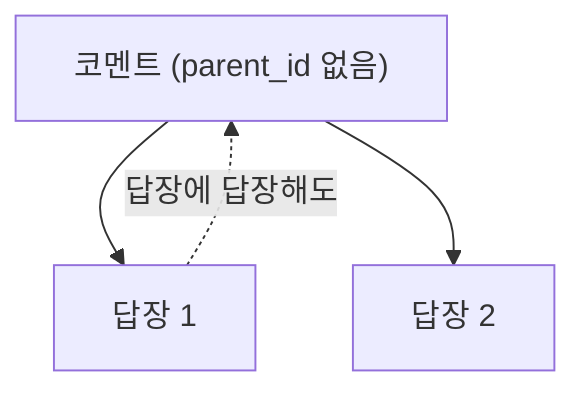
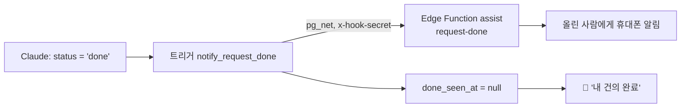
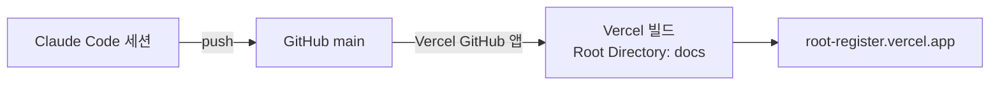
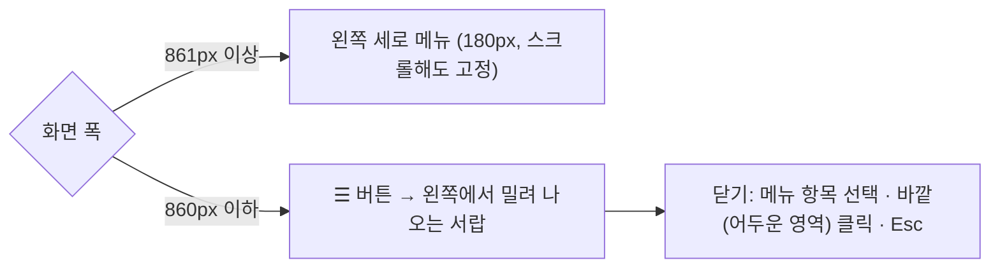

# 작업 기록

Root & Register에서 한 일을 **최신순**으로 적어요. 무엇을 했는지와 함께 왜 그렇게 했는지도 남겨요.

[← README로 돌아가기](../README.md)

## 목차

| 날짜 | 작업 |
|---|---|
| 2026-09-26 | [한글 표현 개편 (스타일 가이드, 마케팅 카피 톤)](#2026-09-26--한글-표현-개편-스타일-가이드-마케팅-카피-톤) |
| 2026-09-26 | [코멘트 좋아요](#2026-09-26--코멘트-좋아요) |
| 2026-09-26 | [새 콘텐츠 주기: 주간 루틴, 새 콘텐츠 알림, 첫 묶음 24문장](#2026-09-26--새-콘텐츠-주기-주간-루틴-새-콘텐츠-알림-첫-묶음-24문장) |
| 2026-09-26 | [이름 정하기: 누가 직접 추가한 후보인지 표시](#2026-09-26--이름-정하기-누가-직접-추가한-후보인지-표시) |
| 2026-09-26 | [코멘트 시각·답장, 건의 완료 알림](#2026-09-26--코멘트-시각답장-건의-완료-알림) |
| 2026-09-26 | [모바일에서 🔔 알림 패널이 화면 밖으로 나가던 문제](#2026-09-26--모바일에서--알림-패널이-화면-밖으로-나가던-문제) |
| 2026-09-26 | [AI 피드백 자동 답변(Gemini), 🔔 알림, 휴대폰 알림](#2026-09-26--ai-피드백-자동-답변gemini--알림-휴대폰-알림) |
| 2026-09-26 | [건의 반영: 영→한 번역 연습, 교차번역 추천 표현, Claude 피드백, 탭 순서](#2026-09-26--건의-반영-영한-번역-연습-교차번역-추천-표현-claude-피드백-탭-순서) |
| 2026-09-26 | [삭제할 때 확인 팝업, 건의함 본인 글 삭제](#2026-09-26--삭제할-때-확인-팝업-건의함-본인-글-삭제) |
| 2026-09-26 | [건의 반영: 교차번역 블라인드, 이름 변경](#2026-09-26--건의-반영-교차번역-블라인드-이름-변경) |
| 2026-09-26 | [건의함에 올린 시각 표시](#2026-09-26--건의함에-올린-시각-표시) |
| 2026-09-25 | [지난 문장 전체 보관함](#2026-09-25--지난-문장-전체-보관함) |
| 2026-09-25 | [제목을 누르면 처음 화면으로](#2026-09-25--제목을-누르면-처음-화면으로) |
| 2026-09-25 | [용어집을 오늘의 문장 바로 다음으로](#2026-09-25--용어집을-오늘의-문장-바로-다음으로) |
| 2026-09-25 | [모든 제출칸 저장 후 잠금, 조사 바로잡기, 이름만 표시](#2026-09-25--모든-제출칸-저장-후-잠금-조사-바로잡기-이름만-표시) |
| 2026-09-25 | [함께 번역: 저장한 내 번역은 잠그고 수정 버튼으로 편집](#2026-09-25--함께-번역-저장한-내-번역은-잠그고-수정-버튼으로-편집) |
| 2026-09-25 | [태그라인 보드 → 영어 카피 연습 (브리프, 블라인드 제출)](#2026-09-25--태그라인-보드--영어-카피-연습-브리프-블라인드-제출) |
| 2026-09-25 | [건의함 탭을 오른쪽 끝 초록 메뉴로](#2026-09-25--건의함-탭을-오른쪽-끝-초록-메뉴로) |
| 2026-09-25 | [이름 정하기를 맨 왼쪽 임시 메뉴로](#2026-09-25--이름-정하기를-맨-왼쪽-임시-메뉴로) |
| 2026-09-25 | [이름 정하기 투표](#2026-09-25--이름-정하기-투표) |
| 2026-09-25 | [메뉴를 다시 위쪽 가로 탭으로 되돌림](#2026-09-25--메뉴를-다시-위쪽-가로-탭으로-되돌림) |
| 2026-09-25 | [함께 번역 화면에서 '세션'이라는 말 없애기](#2026-09-25--함께-번역-화면에서-세션이라는-말-없애기) |
| 2026-09-25 | [건의 반영: 번역 연습 공개 조건, 함께 번역 난이도·이름](#2026-09-25--건의-반영-번역-연습-공개-조건-함께-번역-난이도이름) |
| 2026-09-25 | [작업 기록을 notes/changelog.md로 분리](#2026-09-25--작업-기록을-noteschangelogmd로-분리) |
| 2026-09-25 | [Vercel과 GitHub 연결 (자동 배포)](#2026-09-25--vercel과-github-연결-자동-배포) |
| 2026-09-25 | [메뉴를 좌측 상단으로, 모바일은 햄버거 버튼](#2026-09-25--메뉴를-좌측-상단으로-모바일은-햄버거-버튼) |
| 2026-09-25 | [세션 기록 사용법 안내](#2026-09-25--세션-기록-사용법-안내) |
| 2026-09-25 | [건의함 안내를 항상 접힌 상태로](#2026-09-25--건의함-안내를-항상-접힌-상태로) |
| 2026-09-25 | [건의함 사용법 안내](#2026-09-25--건의함-사용법-안내) |
| 2026-09-25 | [탭 주소에서 `#` 없애기](#2026-09-25--탭-주소에서--없애기) |
| 2026-09-25 | [건의함](#2026-09-25--건의함) |
| 2026-09-25 | [탭별 주소, 새 디자인(폰트·색)](#2026-09-25--탭별-주소-새-디자인폰트색) |
| 2026-09-25 | [예문·추천 표현 팩트체크 (웹 리서치)](#2026-09-25--예문추천-표현-팩트체크-웹-리서치) |
| 2026-09-25 | [탭이 열리지 않던 버그 수정](#2026-09-25--탭이-열리지-않던-버그-수정) |
| 2026-09-25 | [이미 가입된 이메일로 회원가입할 때 안내](#2026-09-25--이미-가입된-이메일로-회원가입할-때-안내) |
| 2026-09-25 | [로그인·회원가입 화면 정리](#2026-09-25--로그인회원가입-화면-정리) |
| 2026-09-25 | [로그인을 이메일·비밀번호로 변경, 가입 허용 목록](#2026-09-25--로그인을-이메일비밀번호로-변경-가입-허용-목록) |
| 2026-09-25 | [번역 연습 (블라인드 제출, 추천 표현)](#2026-09-25--번역-연습-블라인드-제출-추천-표현) |
| 2026-09-25 | [오늘의 문장, 즐겨찾기·코멘트, 어근 짝 삭제, AI 호출 제거](#2026-09-25--오늘의-문장-즐겨찾기코멘트-어근-짝-삭제-ai-호출-제거) |
| 2026-09-25 | [Supabase 연결](#2026-09-25--supabase-연결) |
| 2026-09-25 | [Vercel 배포](#2026-09-25--vercel-배포) |
| 2026-09-25 | [웹사이트 배포 준비](#2026-09-25--웹사이트-배포-준비) |
| 2026-09-25 | [프로그램 설계와 artifact 프로토타입](#2026-09-25--프로그램-설계와-artifact-프로토타입) |

## 2026-09-26 · 한글 표현 개편 (스타일 가이드, 마케팅 카피 톤)
- 요청(희주): 한글 표현이 촌스럽거나 부자연스러운 게 많다. 리서치해서 고급지고 트렌디한, 마케팅에서 쓰는 세련된 표현으로 앱 전반을 바꾸기.
- 진단: 촌스러움은 주로 **마케팅 문장의 상투어**(지금 바로 만나보세요, 소중한 의견, ~을 느껴보세요, 완벽한, 느낌표 재촉)에서 나왔어요. 일상 회화·비즈니스·안내문은 각자 격에 맞는 말투였어요.
- 리서치: 29CM식 에디토리얼 카피(일상어, 장면 제시, 유행어 지양), 토스 UX 라이팅 원칙(해요체·능동형·긍정형·간결), 국립국어원 번역투 자료.
- 결정(희주 님 선택)

| 항목 | 결정 | 이유 |
|---|---|---|
| 톤 | 분야별로 맞춤 | 격을 배우는 앱이라, 안내 방송을 광고 카피처럼 쓰면 틀린 격이 돼요. |
| 이미 푼 한→영 원문 24개 | 그대로 두기 | 원문을 바꾸면 이미 쓴 번역과 짝이 안 맞아요. SQL에서 `drill_answers`가 있는 원문은 건드리지 않게 막았어요. |

- 새 문서: [`notes/style/korean-voice.md`](style/korean-voice.md). 분야별 톤, 피할 상투어 → 바꿀 표현, 번역투 목록을 담았어요. 주간 루틴 지시서가 이 문서를 따르게 연결했어요.
- 바꾼 것 (`supabase/data/20260926_korean_voice_refresh.sql`, 한 트랜잭션)

| 대상 | 개수 | 예 |
|---|---|---|
| 안 푼 한→영 원문 (+ 영어 추천·설명) | 7 | 한정 수량으로 준비했어요. 품절되기 전에 서두르세요. → 딱 300개만 만들었어요. 다시 만들 계획은 없어요. |
| 영→한 추천 표현 (마케팅) | 9 | 소음은 덜고, 나는 더하고. → 소음은 끄고, 나를 켜세요. / 완벽한 휴가, 클릭 한 번이면… → 떠나고 싶은 마음, 클릭 한 번이면 충분해요. |
| 영→한 추천 표현 (비즈니스·일상) | 4 | 초안에 대한 의견을 듣고 싶습니다. → 초안 보시고 의견 주시면 감사하겠습니다. (번역투 '~에 대한' 제거) |
| 용어집 예문·오늘의 문장 | 1 | 새로운 세대의 러너들에게 영감을 주었다 → 새로운 세대를 달리게 만들었다 |
| 앱 부제 | 1 | 뿌리와 결 · 통번역사와 카피라이터의 어원·격 공동 노트 → 말의 뿌리와 결을 함께 읽는, 통번역사와 카피라이터의 노트 |

- 추천 표현을 바꾼 곳은 포인트 설명도 새 표현에 맞게 고쳤어요.
- 그대로 둔 것: 여행 안내문·방송(실제 말투), 이미 자연스러운 일상 회화, 교차번역 추천 표현, 이름 후보(투표 중이고 혜림 님이 쓴 것 포함). 앱 화면 문구는 원래 해요체로 간결해서 부제만 바꿨어요.
- 확인: 바뀐 원문 2개와 추천 표현, 오늘의 문장 번역을 조회해서 반영된 걸 확인했어요.

## 2026-09-26 · 코멘트 좋아요
- 요청(희주): 모든 코멘트에 댓글마다 좋아요.
- 코멘트와 답장마다 ♡ 버튼을 달았어요. 누르면 ♥ N, 다시 누르면 취소돼요. 옆에 누가 좋아했는지 이름이 보여요.
- 공통 `commentBlock()` 한 곳만 고쳐서 앱의 모든 코멘트(용어집, 교차번역, 카피, 오늘의 문장, 번역 연습, 건의함)에 적용돼요.
- DB: `comment_likes`(코멘트, 사람) 1인 1회. 코멘트를 지우면 좋아요도 지워져요. 멤버끼리 누가 눌렀는지 보여요. 본문은 없으니 블라인드 코멘트의 내용이 새지 않아요.
- 누르면 화면에 먼저 반영하고, 저장이 실패하면 다시 불러와 되돌려요.
- 알림은 보내지 않아요. 좋아요마다 휴대폰이 울리면 과해서요.
- 확인: 가짜 데이터에서 상대가 누른 좋아요(♡ 1) 표시, 내가 누르면 ♥ 1과 저장 요청 1건, 오류 0건.

## 2026-09-26 · 새 콘텐츠 주기: 주간 루틴, 새 콘텐츠 알림, 첫 묶음 24문장
- 질문(희주): 번역 연습·교차번역 새 콘텐츠는 언제, 어떤 주기로 올라오나?
- 그때까지는 정해진 주기가 없었어요. 부탁할 때만 추가됐고, 혜림 님은 한→영 24문장을 이미 다 풀었어요.
- 결정(희주 님 선택)

| 항목 | 정한 것 |
|---|---|
| 방식 | Claude 루틴이 정기적으로 직접 써서 넣기 (API 요금 없음, Claude 사용량만) |
| 번역 연습 | 매주 월요일 오전 8:50(한국 시간), 방향마다 12문장(주제마다 3개) + 추천 표현 |
| 교차번역 | 모임 요일이 아직 미정이라, 매주 확인해서 마지막 회차 원문이 10일 이상 지났으면 다음 회차 6개(3개 난이도 × 두 방향) + 추천 표현 → 사실상 2주마다 |
| 알림 | 새 콘텐츠가 들어오면 두 사람에게 휴대폰 알림 |

**구조**
- 루틴 `주간 번역 콘텐츠 추가`(매주 월요일 8:50, 실행할 때마다 새 세션). 할 일은 저장소의 [`notes/routines/weekly-content.md`](routines/weekly-content.md)에 체크리스트로 적었어요. 이 파일을 고치면 다음 실행부터 반영돼요.
- 마이그레이션 `20260926040000_new_content_push.sql`: `drills`, `sessions`에 문장 단위(for each statement) insert 트리거를 달았어요. 한 번에 24줄이 들어와도 알림은 한 번만 가요("새 번역 연습 24문장이 올라왔어요 · 한→영 12, 영→한 12"). 루틴이든 앱에서 원문을 직접 추가하든 똑같이 동작해요.
- 문장과 추천 표현은 한 트랜잭션으로 넣어요. pg_net 요청은 커밋 뒤에 나가서, 알림을 받고 열었을 때 추천 표현이 없는 일이 없어요.
- 화면: 번역 연습에서 최근 1주 안에 올라온 문장에 "새 문장" 칩을 달고, 새 묶음을 맨 위로 올렸어요.

**첫 묶음 (이 세션에서 직접)**
- `supabase/data/20260926_weekly_content.sql`: 한→영 12 + 영→한 12. 직역하면 틀리는 포인트 위주로 골랐어요. 예: You shouldn't have!, Look at the time, I'm down, MIA, subject to availability, by the end of the week.
- 확인: 방향마다 36문장이 됐어요(24 → 36). 추천 표현 24개가 들어갔고, 알림 함수 응답은 `{"ok":true,"sent":2}`예요.
- 교차번역은 1회차가 9/25에 올라와서 이번에는 건너뛰었어요.

**남은 일**
- 루틴에 Supabase 커넥터와 저장소 연결이 아직 없어요. 이 세션에서 루틴을 만들 때는 커넥터를 넘길 수 없었어요. claude.ai 루틴 화면에서 희주 님이 추가해야 첫 자동 실행(9/28 월요일 8:50)이 성공해요.

## 2026-09-26 · 이름 정하기: 누가 직접 추가한 후보인지 표시
- 요청(희주): 직접 추가한 후보에 누가 추가했는지 보이게.
- 원래 후보 카드 맨 아래에 작은 회색 글씨("혜림 제안")로만 있어서 눈에 잘 안 띄었어요. 투표 결과와 빠진 후보 목록에는 아예 없었어요.
- 바꾼 것

| 위치 | 표시 |
|---|---|
| 후보 카드 맨 위 | 직접 추가: 파란 칩 "혜림 직접 추가 · 2026. 9. 26. 오후 7:21" / 미리 준비된 후보: 회색 칩 "Claude 추천" |
| 투표 결과 | 이름 옆에 "혜림 추가" 칩 |
| 빠진 후보 | 이름 옆에 "혜림 추가" 칩 (누가 뺐는지와 함께) |

- DB는 원래 `name_candidates.added_by`, `created_at`에 기록하고 있어서 화면만 고쳤어요.
- 확인: 가짜 데이터(420px 화면)에서 세 위치 모두 표시되고, 오류 0건이었어요.

## 2026-09-26 · 코멘트 시각·답장, 건의 완료 알림
- 요청(희주): 앱의 모든 코멘트에 날짜와 시간을 표시하고, 답장 기능을 넣기. 건의가 완료되면 올린 사람에게 알림.

**1. 코멘트 시각과 답장**
- 앱의 코멘트는 모두 `commentBlock()` 하나를 같이 써요. 여기만 바꿔서 용어집, 교차번역, 영어 카피 연습, 오늘의 문장, 번역 연습, 건의함 코멘트에 한 번에 적용했어요.
- 이름 옆에 `2026. 9. 26. 오전 10:05` 형식(한국 시간)으로 쓴 시각을 보여 줘요.
- 코멘트마다 **답장** 버튼이 있고, 답장은 한 단계만 들여 써요.

| 설계 | 이유 |
|---|---|
| 답장의 답장도 맨 위 코멘트 아래로 모아요(트리거가 `parent_id`를 맨 위로 맞춰요) | 휴대폰 화면에서 들여쓰기가 계속 깊어지면 읽기 어려워요. |
| 답장의 대상(`target_type`, `target_id`)은 트리거가 부모에서 복사해요 | 번역 연습 코멘트의 "제출한 사람에게만 보이기" 규칙이 답장에도 그대로 적용돼요. 앱이 잘못된 대상을 보내도 바로잡혀요. |
| 코멘트를 지우면 답장도 함께 지워져요 | 부모 없는 답장이 남지 않게요. 삭제 확인 팝업에 "답장 N개도 함께 지워져요"를 보여 줘요. |
| 답장하면 원래 코멘트 쓴 사람과 같은 스레드에 답장한 사람에게 휴대폰 알림 | 답장을 놓치지 않게요. 나 자신은 빼요. |

**2. 건의 완료 알림**
- 건의 상태는 Claude가 SQL로 바꿔요. 그래서 앱이 아니라 DB 트리거가 알림을 보내요.

- `requests.done_seen_at`: 올린 사람이 앱에서 완료 알림을 봤는지 저장해요. 🔔에서 누르거나 건의함에서 카드가 보이면 읽음 처리돼요. 멤버는 컬럼 권한으로 이 칸만 더 고칠 수 있어요. 이미 완료된 건의는 알림이 쏟아지지 않게 읽음으로 두었어요.
- 트리거는 JWT가 없어서 `assist` 함수를 `verify_jwt=false`로 다시 배포했어요. 사용자 호출은 원래도 함수 안에서 토큰과 멤버 여부를 확인하고, 트리거 호출은 `private.app_secrets`의 `hook_secret` 헤더로 확인해요.
- 휴대폰 알림을 누르면 `/requests?done=<id>`로 열려서 그 건의 카드로 이동해요.

**확인**
- 가짜 데이터(390px 화면)
  - 코멘트 시각 표시, 기존 답장 들여쓰기, 새 답장 저장(`parent_id` 포함)과 답장 알림 호출 1번
  - 🔔 "내 건의 완료" 표시 → 누르면 건의함으로 이동하고 읽음 처리돼 배지 1 → 0
  - 오류 0건
- DB 롤백 트랜잭션: 답장의 답장이 맨 위 코멘트로 모이고, 대상을 잘못 보내도 부모 대상으로 바로잡혀요. 상태를 done으로 바꾸면 pg_net 요청 1건이 쌓여요.
- 실제 테스트: 희주 이름으로 테스트 건의를 만들어 완료로 바꿨어요. 함수 응답은 `{"ok":true,"sent":2}`로, 희주의 두 기기에 알림이 갔어요. 테스트 건의는 지웠어요.

## 2026-09-26 · 모바일에서 🔔 알림 패널이 화면 밖으로 나가던 문제
- 증상: 휴대폰에서 🔔를 누르면 알림 창이 보이지 않았어요.
- 원인: 좁은 화면에서는 헤더가 줄바꿈되면서 🔔가 왼쪽으로 내려가요. 알림 창은 🔔의 오른쪽 끝에 맞춰 왼쪽으로 펼쳐지게 돼 있어서, 390px 화면에서 왼쪽으로 308px 화면 밖에 그려졌어요(측정값 x = -308).
- 해결: 640px 이하에서는 알림 창을 화면 위쪽에 고정하고 양옆 12px 여백으로 화면 폭에 맞췄어요. 창이 화면을 덮으므로 닫기(×) 버튼을 넣었어요. 바깥을 눌러도 닫혀요.
- 확인: 390px 화면에서 창 위치 x = 12, 폭 366px로 화면 안에 들어와요. 닫기, 피드백 묻기, 읽음 처리까지 두 사람 모두 정상이고, 데스크톱 폭에서도 그대로 동작해요. 오류 0건.

## 2026-09-26 · AI 피드백 자동 답변(Gemini), 🔔 알림, 휴대폰 알림
- 요청(희주): 피드백 요청이 오면 요금 없이 자동으로 답이 달리게. 앱 안에 알림 공간, 그리고 휴대폰으로도 알림.
- 결정: 선택지를 비교해서 희주 님이 골랐어요.

| 방식 | 답 속도 | 비용 | 결과 |
|---|---|---|---|
| Claude 루틴 (하루 몇 번 예약 실행) | 다음 실행 때 | API 요금 없음, Claude 요금제 사용량 | 안 씀 |
| **Gemini 무료 API** | 몇 초 | 결제를 연결하지 않으면 0원 | **채택** |
| 알림만, 답은 수동 | "피드백 확인해줘" 때 | 0원 | 실패 시 대안으로 남김 |

- 알림 방식도 비교했어요. 카톡 "나에게 보내기"는 Claude 쪽 커넥터라 앱이 직접 보낼 수 없어요. 이메일은 발송 서비스 가입이 필요해요. 그래서 **웹 푸시**로 정했어요. 무료이고, 안드로이드는 바로, 아이폰은 홈 화면에 추가한 앱에서 돼요.

**구조**
- Edge Function `assist` (`supabase/functions/assist/index.ts`, JWT 필수, 멤버만)
  - `feedback`: 요청 → Gemini(JSON 스키마로 answer와 mistakes) → 답변 저장, 오답 노트 갱신(같은 실수면 count+1) → 푸시
  - `request-posted`: 새 건의를 희주에게 푸시
  - `test-push`: 내 기기로 테스트 푸시
  - 실패하면 `error`와 `tries`를 기록하고 희주에게 푸시해요. 요청은 대기로 남아서 "다시 시도"나 Claude 수동 답변으로 이어가요.
- 마이그레이션 `20260926020000_auto_feedback_push.sql`
  - `private.app_secrets` + `app_secret()`(service role만): VAPID 비공개 키 보관. 저장소에는 넣지 않았어요.
  - `feedback_requests`: `seen_at`, `error`, `tries`, `by`(gemini/claude). 멤버는 컬럼 권한으로 `seen_at`만 고칠 수 있어요.
  - `members.is_admin`(희주), `feedback_queue()`(관리자에게 요청 현황만, 본문 없이), `push_subscriptions`
- 화면
  - 헤더 🔔: 배지 = 안 읽은 답변 + (희주) 새 건의 + 상대의 대기 요청. 패널에서 누르면 그 카드로 이동해요.
  - 답변이 화면에 보이면 읽음으로 표시해요.
  - 피드백 버튼 "왜 틀렸는지 AI에게 묻기" → "AI가 설명을 쓰는 중…" → "AI 피드백 (Gemini)". Claude가 답한 건 "Claude 피드백"으로 보여요.
  - 알림을 누르면 `/drills?fb=<id>`로 열려 해당 카드로 스크롤해요.
  - `docs/sw.js`(푸시 표시만, 캐시 없음), `manifest.webmanifest`, 아이콘

**확인**
- 가짜 데이터로 두 사람 화면을 띄웠어요.
  - 혜림: 묻기 → 답변과 오답 노트 표시, 함수 호출 1번
  - 희주: 🔔 배지 3(내 답변 1, 새 건의 1, 상대 대기 1), 패널 내용, 화면에 보인 답변은 읽음 처리돼 배지 2
  - 오류 0건
- 함수 배포(빌드) 성공. 실제 호출은 이 작업 환경에서 Supabase로 나가는 연결이 막혀 있어서 못 해 봤어요. Gemini 키를 넣은 뒤 앱에서 눌러 보고 함수 로그로 확인할 예정이에요.
- 기존에 Claude가 단 답변 1건은 `by='claude'`로 표시했어요.

## 2026-09-26 · 건의 반영: 영→한 번역 연습, 교차번역 추천 표현, Claude 피드백, 탭 순서
혜림 님이 올린 건의 4건을 희주 님이 승인해서 반영했어요.

| 건의 | 반영한 것 |
|---|---|
| 영어를 한글로 바꾸는 것도 필요 | 번역 연습에 영→한 24문장(주제별 6개)과 추천 표현을 넣었어요. |
| 번역연습은 수정이 필요합니다 | 방향 필터(한→영/영→한)를 넣고 사람마다 기본 방향을 정했어요(희주 한→영, 혜림 영→한). 탭 순서를 바꿨어요. 연습 주기를 안내에 적었어요. |
| 교차연습에도 추천표현 보기 넣어줘요 | 교차번역 원문 6개에 추천 표현을 넣었어요. 내 번역을 저장하면 열려요. |
| 틀린 경우나 추천표현이 더 맞는 경우 설명 | "왜 틀렸는지 Claude에게 묻기" 버튼, Claude 피드백 표시, 내 오답 노트를 만들었어요. |

**1. 번역 연습 방향**
- `drills`에 `dir`(KR→EN/EN→KR)과 방향과 무관한 원문 칼럼 `source`를 추가했어요. 예전 칼럼 `ko`는 옛 화면 호환을 위해 남기고 비워 둘 수 있게 했어요.
- `members.drill_dir`로 처음 열 때 보이는 방향을 정해요. 이메일을 저장소에 넣지 않으려고, 혜림 님 값은 SQL Editor에서 이름으로 바꿨어요.
- 영→한 문장은 번역투 함정이 있는 표현 위주로 골랐어요. 예: Tell me about it(맞장구), Complimentary breakfast(무료), not in a position to(완곡한 거절). 추천 표현의 포인트에 직역하면 왜 어색한지 적었어요.
- 내 답과 추천 표현의 `lang` 속성을 방향에 맞게 바꿔요(영→한이면 `ko`).

**2. 교차번역 추천 표현**
- 새 테이블 `session_models`(모양은 `drill_models`와 같아요). 읽기는 `session_answered()`로, 내가 그 원문에 번역을 저장해야 보여요. 블라인드 원칙과 맞추려고요.
- 원문 id가 DB마다 달라서, 데이터 파일(`supabase/data/20260926_session_models.sql`)은 제목으로 원문을 찾아 넣어요.

**3. Claude 피드백과 내 오답 노트**
- 선택한 방식: 요청 버튼 + Claude가 확인할 때 답변. 실시간 AI 설명은 요금이 나오고 "요금 없음" 원칙이 바뀌어서 고르지 않았어요.

| 테이블 | 누가 쓰나 | 누가 보나 |
|---|---|---|
| `feedback_requests` | 멤버: 요청 올리기·취소. Claude: `answer`, `answered_at` | 본인만 |
| `mistake_notes` | Claude만 | 본인만 |

- 요청은 번역 하나에 하나예요(`unique`). 번역을 고친 뒤 "다시 묻기"를 누르면 예전 요청을 지우고 새로 올려요.
- 멤버가 요청을 올릴 때 `answer`를 채울 수 없게 insert 정책에서 막았어요. 멤버에게는 update 정책이 없어요.
- 오답 노트는 번역 연습 탭 위쪽에 접혀 있고, 많이 틀린 순서로 보여요. 같은 실수가 또 나오면 Claude가 `count`를 올려요.
- 처리 순서는 README의 [피드백 확인](../README.md#피드백-확인-claude가-하는-일)에 체크리스트로 적었어요.

**4. 탭 순서와 연습 주기**
- 새 순서: 오늘의 문장 → 번역 연습 → 교차번역 → 오늘의 복습 → 용어집 → 영어 카피 연습. 이름 정하기(임시, 맨 왼쪽)와 건의함(맨 오른쪽)은 그대로예요. 매일 하는 연습이 앞에, 모아 보는 곳이 뒤에 오게 했어요.
- 주기: 오늘의 문장은 매일, 번역 연습은 하루 1~2문장(정해진 주기 없음), 교차번역은 2주에 한 번이에요(6개월 12회차). 번역 연습에 안내 상자 "번역 연습은 이렇게 써요"를 새로 만들었어요.

**확인**
- DB: 롤백 트랜잭션으로 두 멤버 권한을 흉내 내 조회했어요.

| 확인 | 희주 | 혜림 |
|---|---|---|
| 기본 방향 (`members.drill_dir`) | KR→EN | EN→KR |
| 보이는 교차번역 추천 표현 | 1개 (번역을 저장한 원문 1개) | 6개 (6개 모두 저장) |
| 피드백 요청 올리기 | 됨 | 됨 |
| 멤버가 `answer`를 직접 고치기 | 0행 (막힘) | 0행 (막힘) |
| 보이는 피드백·오답 노트 | 본인 것만 | 본인 것만 |

- 데이터: 영→한 24문장과 추천 표현 24개, 교차번역 추천 표현 6개를 넣었어요. 번역 연습은 방향마다 24문장이에요.
- 화면: 가짜 데이터로 두 사람 입장을 각각 띄웠어요. 기본 방향(희주 한→영, 혜림 영→한), 추천 표현, 피드백 대기와 답변 표시, 오답 노트, 교차번역 추천 표현과 피드백 버튼, 탭 순서를 확인했어요. 오류는 0건이었어요.

## 2026-09-26 · 삭제할 때 확인 팝업, 건의함 본인 글 삭제
- 요청: 건의함에서 본인 글은 본인만 삭제할 수 있게 해 주세요. 사이트 전체의 삭제 버튼은 누른 뒤 정말 삭제할지 묻는 팝업을 띄워 주세요.
- 건의함 본인 글 삭제: 이미 있던 기능이에요(작성자에게만 `수정 · 삭제`가 보이고, DB의 `own delete` 정책이 본인 글만 지우게 막아요). 이번에 확인 팝업을 붙였어요.
- 확인 팝업(`<dialog id="cfm">`)
  - 예전 방식: 삭제를 누르면 그 자리에 "삭제 확인" 버튼이 나타났어요.
  - 새 방식: 가운데 팝업에 "정말 삭제할까요?", 무엇을 지우는지(예: 용어 ‘obtain’), "삭제하면 되돌릴 수 없어요."가 나오고 `취소`(기본 포커스)와 빨간 `삭제` 버튼이 있어요. 바깥을 누르거나 Esc를 누르면 닫혀요.
  - 적용한 곳: 용어, 교차번역 원문(번역·합의안·메모도 함께 지워진다는 안내 포함), 영어 카피, 코멘트, 건의, 이름 후보 빼기("정말 뺄까요?" + 되살릴 수 있다는 안내)
  - 코드: 삭제 버튼은 모두 `askDel(label,{do,col,id,what,extra})` 하나로 만들고, 확인 뒤 `runConfirmed()`가 실행해요. 예전의 `S.confirm` 인라인 확인 방식은 없앴어요. 삭제 링크는 빨간색으로 구분했어요.
- 확인: 가짜 데이터 사본에서 건의(본인 글에만 삭제 표시), 팝업 문구, 취소로 닫기, 이름 빼기 확인 후 실행, 용어 삭제 팝업, 전체 탭 클릭을 확인했어요. 오류는 0건이었어요.

## 2026-09-26 · 건의 반영: 교차번역 블라인드, 이름 변경
- 건의(혜림, 9/26 00:23): "번역을 저장하기 전에 상대의 번역이 안 보이게, 함께 번역보다 교차번역은 어떤지". 희주 님이 승인했어요.
- 블라인드, 마이그레이션 `20260926000000_blind_session_versions.sql`
  - `session_versions` 읽기 정책을 "멤버 모두"에서 "내 것, 또는 내가 그 원문에 번역을 저장한 경우"로 바꿨어요(`session_answered()`). 화면만 가리는 게 아니라 DB에서 막아요.
  - `session_version_status()`: 누가 저장했는지만 본문 없이 알려 줘요. 번역 칸에 "혜림 · 저장함/아직" 칩이 떠요.
  - 저장 전 안내: "내 번역을 저장하면 상대 번역이 보여요." 저장했는데 상대가 아직이면 "상대가 아직 번역을 저장하지 않았어요."
  - 합의안과 메모는 모임에서 같이 쓰는 칸이라 그대로 둘 다 보여요.
- 이름: 탭, 통계, 안내의 "함께 번역"을 "교차번역"으로 바꿨어요. 안내 팁은 블라인드 설명으로 고쳤어요.
- 검증
  - 롤백 트랜잭션 SQL: 저장 전에는 상대 번역 0건이고, 저장 현황은 보이고, 저장 후에는 2건이 보여요. 멤버가 아닌 계정에는 0건이에요.
  - 가짜 데이터 사본에서 저장 전·후 화면, 칩, 탭 이름, 전체 탭 클릭을 확인했어요. 오류는 0건이었어요.

## 2026-09-26 · 건의함에 올린 시각 표시
- 요청: "show timestamp in suggestion"
- 변경: 건의 카드에 날짜만 나오던 것을 **날짜와 시각**(한국 시간, 예: 2026. 9. 25. 오후 7:00)으로 바꿨어요. 올린 뒤 1분 넘게 지나서 수정한 글에는 "· 수정 (시각)"도 붙어요. `fmtTime()` 함수를 추가했어요.
- 확인: 가짜 데이터 사본에서 올린 시각과 수정 시각이 나오는지 확인했어요. 오류는 0건이었어요.

## 2026-09-25 · 지난 문장 전체 보관함
- 질문: 오늘의 문장은 내일이 되면 사라지나? → 아니요. 날짜별로 `daily_sentences`에 남아요. 다만 화면에는 최근 7일치 문장만 보였고, 뜻과 설명은 다시 볼 수 없었어요.
- 요청(희주 님 선택): 전체 보관함으로.
- 변경(DB 변경 없음)
  - 로더: 지난 문장을 7개가 아니라 전부 불러와요(최대 1000개, 하루 1개라 약 3년 분량).
  - "지난 문장 N개"(접힘) 안에 전체/★ 필터를 넣었어요. 처음에는 20개만 보이고 `더 보기`로 20개씩 늘어나요.
  - 행을 누르면 그 행만 펼쳐져서 한글 뜻, 설명, 어려운 단어, 출처 용어, 코멘트가 보여요. 코멘트가 있는 날은 행에 "코멘트 N" 칩이 붙어요.
  - 오늘 카드와 지난 문장이 같은 `dailyBack()` 함수로 뜻 부분을 그려요.
- 확인: 가짜 데이터 사본(지난 문장 25개, ★ 2개)에서 개수 표시, 20개 + 더 보기(5개 남음), 행 펼침, ★ 필터(2개), 출처 용어 이동, 전체 탭 클릭을 확인했어요. 오류는 0건이었어요.

## 2026-09-25 · 제목을 누르면 처음 화면으로
- 요청: 제목을 누르면 초기 화면으로 가게.
- 변경: 제목 "Root & Register"를 `/` 링크로 감쌌어요. 로그인한 상태에서 누르면 새로고침 없이 오늘의 문장 탭으로 가고 주소도 `/`로 바뀌어요. 뒤로 가기를 누르면 이전 탭으로 돌아가요.
  - Cmd나 Ctrl을 누른 채 클릭하면 새 탭으로 열려요.
  - 로그인 전에는 평범한 링크로 동작해요.
  - 겉모양은 그대로이고, 마우스를 올리면 살짝 흐려지고 "처음 화면(오늘의 문장)으로" 설명이 떠요.
- 확인: 가짜 데이터 사본에서 건의함 → 제목 클릭 → `/`(오늘의 문장) → 뒤로 가기 → `/requests`를 확인했어요. 오류는 0건이었어요.

## 2026-09-25 · 용어집을 오늘의 문장 바로 다음으로
- 요청: 용어집 순서를 오늘의 문장 다음으로.
- 변경: 탭 순서를 이름 정하기(임시) | 오늘의 문장 · **용어집** · 번역 연습 · 오늘의 복습 · 함께 번역 · 영어 카피 연습 … 건의함으로 바꿨어요. 버튼 순서만 바꿨고 주소와 기능은 그대로예요.

## 2026-09-25 · 모든 제출칸 저장 후 잠금, 조사 바로잡기, 이름만 표시
- 요청
  - 모든 제출하는 곳을 "저장하면 잠기고, 수정 버튼으로 편집"하게 바꿔 주세요.
  - 후보 투표의 "나이(가) 뺌"을 문법에 맞게 고쳐 주세요.
  - 사용자 이름은 성을 빼고 이름만 보여 주세요.
- 제출칸 공통 함수 `lockBox()`: 저장 전에는 입력칸, 저장 후에는 읽기 전용 카드(✓ 저장됨/제출함과 시각)와 `수정`, 수정 중에는 `저장`과 `취소`
  - 적용한 곳
    - 함께 번역: 내 번역, 합의안, 메모
    - 번역 연습: 내 번역 (✓ 제출함)
    - 영어 카피 연습: 내 카피에 `수정` 추가(한 줄 입력)
  - 건의함 글은 이미 같은 방식이라 그대로 뒀어요.
  - 빈 칸 저장을 막았고, 저장과 취소 때 입력칸 포커스를 풀어 화면이 바로 바뀌게 했어요.
  - 편집 상태는 `S.editing`(키: `ver:`, `f:<필드>:`, `d:`, `c:` + id) 하나로 관리해요.
- 조사
  - 뺀 사람 표시: 나 → "내가 뺌", 이름은 받침에 따라 "혜림이 뺌", "희주가 뺌"으로 나와요(`subj()`).
  - 다른 곳의 "은(는)", "을(를)"도 정리했어요: "… 계정은 멤버 목록에 없어요", "용어를 추가했어요: ‘…’", "후보를 추가했어요: ‘…’".
- 이름: `members.display_name`을 "희주", "혜림"으로 바꿨어요(DB). 칩, 작성자, 상단 사용자 표시에 모두 이름만 나와요.
- 확인: 가짜 데이터 사본에서 칸마다 잠금, 수정, 취소, 조사 두 경우, 이름 표시를 확인했어요. 오류는 0건이었어요.

## 2026-09-25 · 함께 번역: 저장한 내 번역은 잠그고 수정 버튼으로 편집
- 요청: 내 번역을 저장한 뒤 저장됐는지 헷갈려요. 저장 후에는 편집이 안 되게 하고, 수정 버튼을 눌러야 편집되게 해 주세요.
- 변경(`myVersion()`)
  - 아직 저장 전: 입력칸, `저장` 버튼, "저장하면 잠겨요" 안내
  - 저장 후: 옅은 파란 카드에 번역문을 읽기 전용으로 보여 줘요. `✓ 저장됨 · 저장 시각`(session_versions.updated_at)과 `수정` 버튼이 있어요.
  - 수정 중: 입력칸에 저장된 내용이 채워지고 커서가 끝에 가요. `저장`, `취소` 버튼과 "(수정 중)" 표시가 나와요.
  - 빈 칸으로 저장하려 하면 "번역을 입력해 주세요."로 막아요.
- 함께 고친 점: 입력칸에 포커스가 있으면 화면을 다시 그리지 않는 규칙 때문에, 버튼을 눌러도 포커스가 입력칸에 남는 브라우저(예: Safari)에서는 취소나 저장 뒤에도 화면이 안 바뀌었어요. 저장과 취소 때 입력칸 포커스를 먼저 풀도록 했어요.
- 안내 문구도 "저장하면 ✓ 저장됨으로 잠기고, 고치려면 수정을 눌러요"로 바꿨어요.
- 확인: 가짜 데이터 사본에서 저장된 상태, 수정 → 취소, 수정 → 저장, 빈 칸 경고를 확인했어요. 오류는 0건이었어요.

## 2026-09-25 · 태그라인 보드 → 영어 카피 연습 (브리프, 블라인드 제출)
- 요청: 태그라인 보드가 뭔지 이해가 안 된다는 의견에 제안한 1(이름 변경), 2(사용법 안내), 3(주간 브리프) 모두 반영.
- 이름: 탭 이름을 `영어 카피 연습`으로 바꿨어요. 주소(`/taglines`)와 DB 테이블 이름은 그대로 둬서 기존 링크가 계속 동작해요.
- 사용법 안내: 접이식 "영어 카피 연습은 이렇게 써요". 진행 순서 5단계, 좋은 피드백 예시, 자유 카피와 새 브리프 요청 방법을 담았어요.
- 브리프, 마이그레이션 `20260925080000_copy_briefs.sql`
  - `copy_briefs`: 주, 이름, 무엇을, 누구에게, 톤, 조건. 멤버는 읽기만 하고, Claude가 SQL로 넣어요.
  - `taglines.brief_id`를 추가했어요. 브리프 카피는 블라인드예요: 내가 그 브리프에 낸 뒤에만 남의 카피가 보여요(`copy_answered()`). 누가 몇 개 냈는지는 본문 없이 `copy_status()`로 보여 줘요.
  - 자유 카피(`brief_id` 없음)는 예전처럼 모두 보여요.
  - 권한: 예전 "shared rw"(누구나 수정·삭제)를 없애고 본인 것만 추가, 수정, 삭제할 수 있게 바꿨어요.
- 이번 주 브리프 3개(2026-09-21 주, 가상 브랜드, `supabase/data/20260925_copy_briefs.sql`): FIZZO 제로 탄산수(sugar 금지, 6단어), Slow Pages 독립서점(book 금지, 한 문장), Golmok 서울 골목 가이드 앱(관광지 이름 금지, 8단어)
- 화면: 브리프 카드(스펙, 조건 강조, 멤버별 제출 수, 내 카피 최대 3개, 상대 카피), 지난 브리프(접힘), 자유 카피
- 검증
  - 롤백 트랜잭션 SQL: 내가 내기 전에는 상대 브리프 카피가 0건이고 자유 카피는 보여요. 제출 현황은 보이고, 남의 카피 삭제는 0행이에요. 내가 낸 뒤에는 2건이 보여요. 멤버가 아닌 계정에는 브리프가 0건이에요.
  - 가짜 데이터 사본에서 브리프, 지난 브리프, 안내, 자유 카피, 전체 탭 클릭을 확인했어요. 오류는 0건이었어요. 지난 브리프 안의 제출 버튼이 전체 폭으로 늘어나던 스타일도 고쳤어요.

## 2026-09-25 · 건의함 탭을 오른쪽 끝 초록 메뉴로
- 요청: 건의함도 다른 메뉴와 차이 나게 디자인해 주세요.
- 이유: 건의함은 공부 메뉴가 아니라 앱에 대한 소통 창구라서, 공부 탭들과 떨어뜨려 구분했어요.
- 변경
  - 탭 줄 오른쪽 끝으로 옮겼어요(`margin-left:auto`).
  - 초록(`--ok`) 테두리 버튼으로 바꾸고, 선택하면 초록 배경이 돼요.
  - 탭 색 정리: 공부 탭은 파랑, 이름 정하기(임시)는 빨강, 건의함(소통)은 초록.
  - 새 건의 배지: 아직 확인 전(`new`)인 건의 수를 초록 배지로 보여 줘요. 0이면 숨겨요.
- 확인: 가짜 데이터 사본에서 배지 1, 선택 색, 모든 탭 이동을 확인했어요. 오류는 0건이었어요.

## 2026-09-25 · 이름 정하기를 맨 왼쪽 임시 메뉴로
- 요청: 이름 정하기 메뉴만 왼쪽에, 다른 메뉴와 색을 다르게. 투표가 끝나면 숨길 임시 메뉴라서요.
- 변경
  - 탭 줄 맨 왼쪽으로 옮기고 얇은 구분선으로 다른 탭과 나눴어요.
  - 빨간 계열(`--ko`) 점선 테두리와 옅은 배경에 앞쪽 점 표시를 넣었어요. 선택하면 빨간 배경이 돼요. 다른 탭은 선택되면 파란색이에요.
  - 숨기기 스위치: `docs/index.html`의 `const SHOW_NAMING=true`를 `false`로 바꾸면 탭과 구분선이 사라지고 `/names` 주소도 오늘의 문장으로 가요. 투표 데이터는 DB에 그대로 남아요.
- 확인: 가짜 데이터 사본에서 맨 왼쪽 표시, 선택 색, 모든 탭 이동을 확인했어요. 오류는 0건이었어요.

## 2026-09-25 · 이름 정하기 투표
- 요청: 앱 이름을 정하는 투표 메뉴. 둘 다 투표하고 결과를 보며, 마음에 안 드는 후보는 빼고 다시 추천받기.
- 결정(희주 님 선택)
  - 투표 방식: 마음에 드는 후보에 모두 좋아요를 누르는 방식
  - 빼기: 둘 다에게 적용하고, 되살릴 수 있어요.
  - 메뉴: 가로 탭을 그대로 두고 맨 끝에 `이름 정하기` 탭(`/names`)을 추가
- DB: 마이그레이션 `20260925070000_naming_vote.sql`
  - `name_candidates`: 이름, 뜻, 이유, 순서, 보이기, 빼기(누가, 언제), 추가한 사람
  - `name_votes`: 후보마다 1인 1행
  - 멤버는 컬럼 권한으로 후보 추가(name, gloss, why, shown)와 보이기·빼기만 할 수 있어요. 이름 수정은 막혀 있어요.
  - 파일 이름을 `070000`으로 지은 이유: 클라우드 세션의 `20260925060000_request_feedback_1.sql`과 순서가 겹치지 않게 하려고요.
- 후보 30개는 Claude가 미리 썼어요(`supabase/data/20260925_name_candidates.sql`). API 호출은 없어요.
  - 처음에는 6개가 보이고, "다시 추천하기"를 누르면 4개씩 더 나와요.
  - 다 쓰면 "Claude에게 새 후보 요청" 버튼이 건의함(종류: 콘텐츠)에 좋아요 받은 후보와 빠진 후보를 담아 요청을 올려요.
  - 직접 후보를 추가할 수도 있어요.
- 화면: 투표 결과(막대, 누가 좋아했는지, "둘 다 좋아해요"), 후보 카드(뜻, 이유, 좋아요, 빼기), 다시 추천하기, 직접 추가, 빠진 후보(누가 뺐는지, 되살리기)
- 진행 중 있었던 일: 로컬 세션에서 왼쪽 메뉴 위에 이 기능을 만들었는데, 그사이 클라우드 세션에서 메뉴를 가로 탭으로 되돌린 커밋이 `main`에 올라와 있었어요. push가 거절돼서 알게 됐어요. 희주 님 확인을 받아 가로 탭을 유지하고, 이름 정하기 부분만 현재 `main`에 옮겨 적용했어요.
- 검증
  - 롤백 트랜잭션 SQL: 상대 투표는 보이지만 지울 수 없어요(0행). 빼기에 누가 뺐는지 남아요. 직접 추가하면 작성자가 기록돼요. 이름 수정은 권한 거부돼요. 멤버가 아닌 계정에는 0건이 보여요.
  - 가짜 데이터 사본: 투표 결과, 둘 다 좋아함 강조, 빼기 확인과 되살리기, 다시 추천하기, 전체 탭 클릭을 확인했어요. 오류는 0건이었어요.

## 2026-09-25 · 메뉴를 다시 위쪽 가로 탭으로 되돌림
- 요청: 메뉴를 왼쪽으로 옮기기 전으로 되돌리기.
- 방법: [메뉴를 좌측 상단으로](#2026-09-25--메뉴를-좌측-상단으로-모바일은-햄버거-버튼) 커밋(`25aea02`)의 `docs/index.html` 변경만 `git revert`로 되돌렸어요. 왼쪽 세로 메뉴, 모바일 햄버거 버튼과 서랍, 관련 CSS·JS가 모두 빠졌어요.
- 유지한 것: 그 뒤에 한 변경(탭 이름 `함께 번역`, 난이도, 번역 연습 공개 조건 등)은 그대로예요. README와 작업 기록도 그대로 두고, 그때 기록은 이력으로 남겨요.
- 지금 모습: 통계 아래에 탭이 가로로 한 줄, 스크롤해도 위에 붙어 있어요. 좁은 화면에서는 탭 줄을 옆으로 밀어서 봐요.
- 확인: 가짜 데이터로 띄운 화면에서 가로 탭이 보이고, 탭 이동·번역 연습·난이도 필터가 정상이고 오류는 0건이었어요.

## 2026-09-25 · 함께 번역 화면에서 '세션'이라는 말 없애기
- 문제: 탭 이름은 `함께 번역`으로 바꿨지만, 화면 안에는 "SESSION 1", "세션 원문 추가", "세션 1주 전" 같은 말이 그대로 남아 있었어요.
- 원인: "세션"이 세 가지 뜻으로 섞여 쓰이고 있었어요. 뜻마다 다른 쉬운 말로 바꿨어요.

| 뜻 | 예전 | 바꾼 말 | 이유 |
|---|---|---|---|
| 몇 번째 만남인지 (번호) | SESSION 1, 세션 번호 | **1회차**, 회차 | 12번 중 몇 번째인지 바로 알 수 있어요. |
| 두 사람이 만나는 자리 | 세션 1주 전, 세션 중, 세션에서 다듬은 | **모임** 1주 전, 모임 중 | 일상에서 쓰는 말이에요. |
| 목록에 있는 글 하나 | 세션 원문 추가, 세션 삭제 | **원문** 추가, 원문 삭제 | 한 회차에 원문이 여러 개(난이도·방향별)라서, 지우는 대상은 회차가 아니라 원문 하나예요. |

- 같이 고친 것: 안내의 "번역 연습은 둘 다 제출해야 공개돼요"는 바로 전 변경과 맞지 않아서 "내가 제출해야 상대 번역이 보여요"로 고쳤어요.
- 그대로 둔 것: 주소 `/sessions`, DB 테이블 `sessions`, 코드 안 이름은 바꾸지 않았어요. 사용자에게 보이지 않고, 바꾸면 예전 링크와 데이터 연결이 깨질 수 있어서예요.
- 확인: 가짜 데이터로 띄운 화면(안내 펼친 상태 포함)에 "세션"이라는 글자가 0번 나오는 것을 확인했어요.

## 2026-09-25 · 건의 반영: 번역 연습 공개 조건, 함께 번역 난이도·이름
건의함에 올라온 우혜림 님의 건의 2건을 희주 님이 승인해서 반영했어요.

**건의 1. 번역 연습: 상대가 제출하지 않아도 내가 제출하면 추천 표현 보기, 코멘트 스포 방지**
- 변경 전: 추천 표현은 두 사람이 **모두** 제출해야 열렸어요. 코멘트는 제출 여부와 관계없이 모두에게 보였어요.
- 변경 후:

| 항목 | 누가 볼 수 있나 | RLS |
|---|---|---|
| 내 번역 | 나 | 그대로 |
| 상대 번역 | 내가 그 문장을 제출했을 때 | 그대로 (`drill_answered`) |
| 추천 표현 | 내가 그 문장을 제출했을 때 | `drill_revealed` → `drill_answered` |
| 번역 연습 코멘트 | 작성자, 그리고 그 문장을 제출한 사람 | `comments` read 정책에 조건 추가 |

- 이유: 한 사람이 먼저 풀고 기다려야 하는 문제가 있었어요. 상대 번역은 여전히 내가 제출해야 보이므로 블라인드 원칙은 지켜져요. 추천 표현도 제출한 사람만 보니 스포가 되지 않아요. 코멘트를 제출자에게만 보여 주면 각자 시간 날 때 코멘트를 남겨 둘 수 있어요.

**건의 2. 세션 기록: 난이도 조절, 이름이 무슨 뜻인지 모르겠음**
- `sessions.level` 칼럼을 추가했어요(`쉬움`·`보통`·`실전`, 기본값 `보통`). 기존 기사 원문 2개는 `실전`이 됐어요.
- 쉬운 원문을 넣었어요(`supabase/data/20260925_sessions_leveled.sql`). 모두 SESSION 1에 들어가서, 첫 세션에서 난이도를 골라 시작할 수 있어요.

| 난이도 | 기준 | 새로 넣은 원문 |
|---|---|---|
| 쉬움 | 1~2문장, 일상 대화·안내문 | 약속 바꾸기(KR→EN), 카페 휴무 안내(EN→KR) |
| 보통 | 2문장, 생활 기사체, 전문 용어 없음 | 도서관 연장 운영(KR→EN), 식후 산책 연구(EN→KR) |
| 실전 | 실제 기사 수준 | (기존) 채용 축소 기사, 주택 전환 기사 |

- 화면: 원문 카드에 난이도 칩, 목록 위에 난이도 필터(전체·쉬움·보통·실전), 원문 추가 폼에 난이도 선택을 넣었어요. 같은 회차 안에서는 쉬움 → 보통 → 실전 순으로 보여요.
- 탭 이름을 `세션 기록`에서 `함께 번역`으로 바꿨어요. "원문 하나를 각자 번역하고 함께 비교·합의한다"는 뜻이 이름에 바로 드러나게 했어요. 주소(`/sessions`)와 DB 테이블 이름은 그대로 둬서 예전 링크가 깨지지 않아요.
- 통계의 `세션 N/12`는 원문 개수를 세고 있었어요. 한 회차에 원문이 여러 개가 되니 `함께 번역 N/12회`로 바꾸고, 서로 다른 회차 번호 수를 세요.

**확인**
- DB: 두 멤버의 권한으로 각각 조회해 봤어요. 추천 표현은 각자 제출한 문장 수만큼(혜림 6, 희주 2) 보였고, 제출하지 않은 문장의 남의 코멘트가 보이는 경우는 0건이었어요.
- 화면: 가짜 데이터로 로컬 서버에 띄워 확인했어요. 제출한 문장만 추천 표현 버튼이 보이고, 난이도 필터가 동작하고, 탭 이름이 바뀐 것을 확인했어요. 오류는 0건이었어요.

## 2026-09-25 · 작업 기록을 notes/changelog.md로 분리
- 문제: README에 작업 기록이 계속 쌓여 280줄이 넘었어요. 앱 소개나 설정 방법을 찾기 어려웠어요.
- 결정: 작업 기록 전체를 `notes/changelog.md`로 옮겼어요. 최신순으로 적고, 맨 위에 목차 표를 둬요. README에는 최근 5개와 링크만 남겨요.

| 방법 | 결과 | 이유 |
|---|---|---|
| GitHub Wiki | 안 씀 | 무료 플랜에서는 비공개 저장소에 Wiki를 쓸 수 없어요. Wiki는 별도 저장소라 코드와 같은 커밋에 기록을 남길 수도 없어요. |
| `docs/` 폴더 | 안 씀 | `docs/`는 Vercel이 배포하는 사이트 폴더예요. 여기 두면 작업 기록이 `root-register.vercel.app`에서 공개돼요. |
| `notes/changelog.md` | **채택** | 코드와 같은 커밋에 기록되고, GitHub에서 목차 링크로 바로 이동할 수 있어요. 배포에는 포함되지 않아요. |

- 앞으로: 새 기록은 `notes/changelog.md`의 목차 표 맨 위와 본문 맨 위에 추가해요. README의 "최근 5개" 표도 함께 갱신해요.

## 2026-09-25 · Vercel과 GitHub 연결 (자동 배포)
- 문제: 메뉴 변경을 `main`에 올렸는데 사이트가 바뀌지 않았어요. 처음 배포할 때 `vercel git connect`가 실패해서 Vercel이 GitHub와 연결되지 않은 상태였어요. 그동안은 `npx vercel deploy --prod`로 직접 배포할 때만 사이트가 바뀌었어요.
- 해결: 희주 님이 Vercel 프로젝트 설정(Settings → Git)에서 `gooseybee/root-register`를 연결했어요.
- 이제 흐름은 이래요.

- 헷갈리기 쉬운 점: GitHub의 **Authorized GitHub Apps**는 로그인 권한 목록이라 저장소 권한을 줄 수 없어요. 저장소 권한은 **Installed GitHub Apps**나 https://github.com/apps/vercel 에서 줘요. Vercel **팀** 설정의 Git 메뉴("Origin")가 아니라 **프로젝트** 설정의 Git 메뉴에서 연결해요.
- 작업 방식: Claude는 작업 브랜치와 `main`에 함께 push해요. `main`이 곧 배포예요.

## 2026-09-25 · 메뉴를 좌측 상단으로, 모바일은 햄버거 버튼
- 요청: 가로로 늘어선 탭 메뉴를 왼쪽 위로 옮기고, 모바일에서는 햄버거 버튼으로 열기.

| 화면 | 메뉴 위치 | 이유 |
|---|---|---|
| 데스크톱 | 본문 왼쪽 세로 목록, 맨 위부터 시작 | 탭이 7개로 늘어 가로 한 줄에 다 안 들어가고 옆으로 스크롤해야 했어요. 세로 목록은 전부 한눈에 보여요. |
| 모바일 | 제목 왼쪽 ☰ 버튼, 누르면 서랍 | 좁은 화면에서 세로 메뉴를 늘 띄워 두면 본문 폭이 너무 줄어요. |

- 구조: `nav#tabs`를 `.wrap` 밖으로 꺼내 `.shell`(2열 그리드)의 첫 칸에 뒀어요. 모바일에서는 같은 `nav`를 `position:fixed` 서랍으로 바꿔요. 메뉴 마크업은 하나만 있어요.
- 로그인 전에는 메뉴와 ☰ 버튼을 모두 숨기고, 본문을 가운데 정렬해요(`.shell:has(> nav[hidden])`).
- 접근성: ☰ 버튼에 `aria-expanded`와 "메뉴 열기/닫기" 라벨을 달았고, 서랍이 열리면 현재 탭으로 포커스가 가요. Esc로 닫으면 포커스가 ☰ 버튼으로 돌아와요.
- 확인: Playwright로 1280px과 390px 화면을 캡처했어요. ☰ 열기와 Esc 닫기를 눌러 봤고, 런타임 오류는 0건이었어요.

## 2026-09-25 · 세션 기록 사용법 안내
- 세션 기록 탭 맨 위에 접이식 안내 "세션 기록은 이렇게 써요"를 넣었어요. 건의함과 같은 방식으로 항상 접힌 상태로 시작해요.
  - 담긴 내용: 진행 순서 5단계(1주 전 원문 올리기, 각자 번역, 세션 중 비교, 합의안과 메모, 용어집 추가), 칸마다 누가 고칠 수 있는지, 상대 번역이 바로 보인다는 점과 블라인드로 하려면 번역 연습 탭을 쓰라는 안내
- 안내 상자는 공통 함수 `guideBox(key, title, html)`로 묶었어요. 건의함과 세션 기록이 같은 함수를 써요.
- 키 이름 주의: 세션 카드의 펼침 상태를 `sess-` 접두어로 추적하고 있어서, 안내 키는 `guide-sess`로 지었어요.
- 확인: 가짜 데이터 사본에서 기본으로 접혀 있는지, 펼쳐지는지, 세션 카드 펼침 상태에 영향이 없는지, 건의함 안내가 따로 동작하는지 확인했어요. 오류는 0건이었어요.

## 2026-09-25 · 건의함 안내를 항상 접힌 상태로
- 요청에 따라 "건의함은 이렇게 써요" 안내가 항상 접힌 상태로 시작해요. localStorage 기억은 없앴어요.
- 펼친 상태는 같은 화면 안에서 다시 그려질 때만 유지돼요. 새로고침하거나 다시 방문하면 접혀 있어요.

## 2026-09-25 · 건의함 사용법 안내
- 건의함 탭 맨 위에 접이식 안내 "건의함은 이렇게 써요"를 넣었어요.
  - 담긴 내용: 진행 순서 4단계, 상태 6개의 뜻(색 칩 포함), 잘 전달되는 건의 쓰는 법(어디서/무엇을/왜)과 예시, 코멘트·수정·삭제 안내
  - 처음에는 펼쳐져 있고, 접으면 그 브라우저에서는 접힌 채로 기억해요(localStorage `rr.reqGuide`).
- 확인: 가짜 데이터 사본으로 모바일(430px) 화면을 캡처해서 확인했어요. 가로 넘침과 오류는 없었어요.

## 2026-09-25 · 탭 주소에서 `#` 없애기
- 탭 주소를 `#drills` 형태에서 `/drills`, `/requests`, `/terms` 같은 경로로 바꿨어요. 오늘의 문장은 `/`예요.
  - 탭을 누르면 `history.pushState`로 주소만 바꾸고, 뒤로 가기는 `popstate`로 처리해요.
  - 예전 `#drills` 링크로 들어오면 `/drills`로 자동으로 바꿔 줘요.
- `vercel.json` rewrite: 어떤 경로로 와도 `index.html`을 보여 줘요. 실제 파일(`config.js` 등)은 그대로 제공돼요.
  - CLI 배포는 명령을 실행한 폴더(저장소 루트)의 `vercel.json`을 읽어요. `docs/`에만 두었을 때는 적용되지 않았어요.
  - 그래서 루트와 `docs/` 두 곳에 같은 파일을 두었어요. 나중에 GitHub 자동 배포를 연결하면 Root Directory(`docs`)의 파일이 쓰여요.
- 로그인 메일 링크의 돌아올 주소는 항상 `/`로 고정했어요. Supabase Redirect URL 허용 목록과 맞추기 위해서예요.
- 확인
  - 가짜 데이터 사본에서 예전 `#drills` 링크, 탭 클릭, 오늘의 문장 `/`, 뒤로 가기, 해시 링크 변환을 모두 확인했어요. 오류는 0건이었어요.
  - 배포 후 `/requests`, `/drills`는 200(앱 페이지)을, `/config.js`는 JS 파일을 그대로 돌려줬어요.

## 2026-09-25 · 건의함
- 요청: 친구가 수정이나 추가를 원하는 기능을 앱에 올리면, 이 Claude 세션에서 받아 처리하기.
- 결정: Claude 세션은 밖에서 오는 알림으로 깨어날 수 없어서, "건의함 확인해줘"라고 말하면 확인하는 방식으로 정했어요. 반영은 희주 님 승인 후에 해요.
- 마이그레이션 `20260925050000_requests.sql`
  - `requests` 테이블: 제목, 본문, 종류, 상태, 작성자, Claude 처리 메모
  - 멤버는 컬럼 권한으로 title, body, kind만 쓸 수 있어요. status, claude_note, author는 앱에서 바꿀 수 없어요.
  - 코멘트와 즐겨찾기 대상에 `request`를 추가했어요.
- 화면: `건의함` 탭(`#requests`)
  - 건의 올리기(제목, 종류, 내용), 상태 필터(진행 중 / 완료·보류 / 전체), 상태별 색 칩
  - 본인 글 수정·삭제, Claude 처리 메모 박스, 별과 코멘트
- 검증
  - 롤백 트랜잭션 SQL 테스트: B가 올린 글의 작성자가 B로 채워지고, B의 status 변경과 status를 지정한 insert는 모두 권한 거부됐어요. A는 B의 글을 읽을 수 있지만 수정은 0행이었어요. 멤버가 아닌 계정에는 0건이 보였어요.
  - 가짜 데이터 사본에서 렌더, 필터, 수정 모드, 코멘트를 확인했어요. 런타임 오류는 0건이었어요.

## 2026-09-25 · 탭별 주소, 새 디자인(폰트·색)
- 탭별 주소: 탭마다 `#daily`, `#drills`, `#review`, `#terms`, `#sessions`, `#taglines` 주소가 생겼어요.
  - 뒤로/앞으로 가기, 북마크, 링크 공유가 돼요.
  - 로그인 직후 주소에 남던 `#`나 인증 토큰은 현재 탭 주소로 정리해요.
- 폰트: IBM Plex Sans KR과 Noto Serif KR을 **Pretendard Variable**(본문·UI)과 **Bricolage Grotesque**(영어 문장·제목)로 바꿨어요. 작은 날짜 라벨에는 JetBrains Mono를 써요.
- 색·모양
  - 강조색을 선명한 파랑(#3E63DD)과 빨강(#E5484D)으로 바꿨어요.
  - 활성 탭과 주요 버튼을 파랑 알약 모양으로 바꾸고, 카드에 부드러운 그림자와 큰 라운드를 줬어요.
  - 통계는 칩 형태로 바꿨어요.
  - 오늘의 문장 카드에 은은한 그라데이션을 넣고 문장을 크게 키웠어요.
  - 다크 모드 팔레트도 함께 맞췄어요.
- 확인: 가짜 데이터 사본으로 데스크톱(1100px) 오늘의 문장·번역 연습, 모바일(390px) 다크 모드를 캡처해서 확인했어요. 런타임 오류는 0건이었어요.

## 2026-09-25 · 예문·추천 표현 팩트체크 (웹 리서치)
- 대상: 영어 문장 86개 (용어집 예문 36개, 번역 연습 추천 번역 24개, 대안 26개).
- 방법: 부자연스러울 수 있는 표현을 골라 뉴스, 사전, 비즈니스 메일 가이드, 항공사·공항 안내 등 실제 쓰임을 검색해 확인했어요.
- 실제 쓰임이 확인되어 유지한 것: ease pressure on rents(Bloomberg 기사), bail on(약속 펑크, 구어), wiped out(녹초, 사전 등재), Something has come up on our end(일정 변경 메일 템플릿), expects revenue to grow ~% year over year(실적 발표문), data were/was(학술은 복수, 일반은 단수도 허용).
- 수정 5건 (`supabase/data/20260925_factcheck_fixes.sql`)
  - dr-m2: Your skin will notice first → Your skin will feel the difference first. "notice first"는 카피에서 쓰는 조합이 확인되지 않았고, "feel the difference"가 스킨케어 광고의 정형 표현이에요.
  - dr-b2: Please find attached → I've attached. 여러 비즈니스 메일 가이드가 "Please find attached"를 딱딱하고 오래된 문구로 봐요. 대안으로 남기고 설명을 붙였어요.
  - dr-t4: Do you take card? → Do you take cards? 단수형은 영국·호주 구어라는 설명을 추가했고, 대안 Is card okay?는 Can I pay by card?로 바꿨어요.
  - dr-t5: 공항에서 쓰는 실제 명칭(baggage service office)과 carousel 표현으로 다듬었어요.
  - dr-t6 대안: tomorrow's morning tour → tomorrow morning's tour (소유격 위치 오류).

## 2026-09-25 · 탭이 열리지 않던 버그 수정
- 증상: 오늘의 문장 외의 탭을 눌러도 화면이 바뀌지 않았어요.
- 원인: 오늘의 문장을 첫 화면으로 고정하면서 "마지막 탭 기억" 코드를 지울 때 세미콜론까지 같이 지웠어요. 그래서 탭 클릭 코드가 `S.revealed=falserender()`가 됐어요. 문법상으로는 맞아서 구문 검사를 통과했지만, 누를 때마다 ReferenceError가 났어요.
- 수정: `S.revealed=false;render();`
- 재발 방지 확인: supabase 클라이언트를 가짜 데이터로 대체한 로컬 사본에서 6개 탭을 모두 누르고, 탭 안의 코멘트, 펼치기, 필터, 주제 버튼을 전부 눌러 봤어요. 런타임 오류는 0건이었어요.

## 2026-09-25 · 이미 가입된 이메일로 회원가입할 때 안내
- 증상: 회원가입을 눌렀는데 확인 메일이 오지 않았어요.
- 원인: 인증 로그가 `user_repeated_signup`이었어요. 그 이메일은 예전 로그인 링크 방식으로 이미 가입·확인된 계정이었어요. Supabase는 계정이 있는지 노출하지 않으려고 오류 없이 성공처럼 응답하고 메일은 보내지 않아요. 링크로 만든 계정이라 비밀번호도 없었어요.
- 수정: `signUp` 응답의 `user.identities`가 비어 있으면(이미 가입됨) 비밀번호 재설정 화면으로 보내고 안내 문구를 보여 줘요.
- 해결 방법: 기존 계정은 "비밀번호를 잊었어요"로 재설정 링크를 받아 비밀번호를 정하면 돼요.

## 2026-09-25 · 로그인·회원가입 화면 정리
- 문제 1: 로그인 폼이 내용 폭만큼 좁아져서 입력칸이 작고, 로그인/회원가입 탭 버튼의 크기가 들쭉날쭉했어요. 로그인 전인데도 통계와 탭이 보였어요.
- 문제 2: `index.html`에 doctype, `<meta charset>`, viewport가 없었어요. artifact에서 옮길 때 빠진 부분이에요. 그래서 휴대폰에서는 화면이 축소돼 보이고, 서버의 문자셋 헤더에 기대고 있었어요.
- 수정 사항
  - 로그인 영역을 최대 400px 카드로 바꿨어요. 탭은 두 칸 균등 폭, 입력칸과 버튼은 전체 폭이에요. 탭과 같은 제목은 없앴어요.
  - 로그인 전에는 통계와 탭을 숨겨요.
  - doctype, charset, viewport, head/body 구조를 추가하고 favicon도 넣었어요.
- 확인: 로컬 서버에서 데스크톱(1200px)과 모바일(390px) 화면을 캡처해서 확인했어요.

## 2026-09-25 · 로그인을 이메일·비밀번호로 변경, 가입 허용 목록
- 요청: 로그인 링크 대신 회원가입과 비밀번호 로그인으로 바꾸고, 로그인 정보를 브라우저에 저장할 수 있게. 가입은 두 사람만.
- 화면: 로그인, 회원가입(비밀번호 확인 포함), 비밀번호 재설정(메일 링크 → 새 비밀번호)을 만들었어요.
  - 입력칸에 `autocomplete`(username / current-password / new-password)를 달아 브라우저가 비밀번호 저장을 제안해요.
  - 로그인 상태는 supabase-js가 브라우저에 보관해서, 로그아웃하기 전까지 유지돼요.
- 마이그레이션 `20260925040000_signup_allowlist.sql`: `hook_before_user_created(event)`
  - `members`에 없는 이메일이면 403 메시지로 가입을 거부해요.
  - `supabase_auth_admin`만 실행할 수 있어요.
  - SQL로 직접 호출해 멤버 이메일은 통과(`{}`)하고 다른 이메일은 거부되는 것을 확인했어요.
- 대시보드에서 훅을 연결해야 실제 가입에 적용돼요(Authentication → Hooks → Before User Created).
  - 연결 전이라도 멤버가 아닌 계정은 RLS 때문에 데이터를 볼 수 없어요.

## 2026-09-25 · 번역 연습 (블라인드 제출, 추천 표현)
- 요청: 한국어 문장을 각자 영어로 번역해 올리고, 모두 제출했을 때만 더 자연스러운 추천 표현을 보여 주기. 주제별 탭에 문장 여러 개.
- 사용자가 고른 방식: 블라인드 제출, 개인 피드백은 채팅으로 요청(요금 없음). 격별 추천 표현과 공개 후 잠금은 넣지 않았어요.
- 마이그레이션 `20260925030000_drills.sql`
  - 테이블: `drills`, `drill_answers`, `drill_models`
  - 함수: `drill_answered()`, `drill_revealed()`, `drill_status()`
  - `comments`, `favorites`의 대상에 `drill`을 추가했어요.
- 데이터 `supabase/data/20260925_drills.sql`: 4개 주제 × 6문장 = 24문장. 추천 표현(best, 대안, 포인트)은 Claude Code가 직접 썼어요. API 호출은 없어요.
- 화면: `번역 연습` 탭을 추가했어요.
  - 주제 선택과 전체/미제출/★ 필터가 있어요.
  - 멤버별 제출 상태 칩, 내 번역 제출·수정, 상대 번역, 추천 표현 펼치기를 넣었어요.
  - 별(★)과 코멘트도 달 수 있어요.
- 검증: 롤백 트랜잭션에서 두 멤버의 JWT를 흉내 내 확인했어요.
  - A만 제출: A는 자기 답 1건만 보고, B는 0건을 보고, 추천 표현은 둘 다 0건이에요.
  - 둘 다 제출: 서로의 답과 추천 표현이 모두 보여요.
  - 멤버가 아닌 계정: 모든 테이블이 0건이에요.
- 알려진 한계: 상대가 제출한 사실은 realtime으로 오지 않아요(블라인드라 그 행이 안 보이기 때문). 내가 무언가 저장하거나 새로고침하면 상태 칩이 갱신돼요.

## 2026-09-25 · 오늘의 문장, 즐겨찾기·코멘트, 어근 짝 삭제, AI 호출 제거
- 요청: 목록마다 코멘트·즐겨찾기, 어근 짝 삭제, 첫 화면을 오늘의 문장으로. 도중에 "요금이 절대 안 나오게"라는 요청이 추가됐어요.
- 마이그레이션 `20260925020000_comments_favorites_daily.sql`
  - `comments`: 범용 코멘트. 기존 `tagline_comments`를 옮긴 뒤 삭제했어요.
  - `favorites`: 사람마다 따로 저장해요.
  - `daily_sentences`와 `ensure_daily()`: 서울 날짜 기준 하루 1개. 최근 30일에 안 쓴 영어 예문 중 설명이 있는 것을 우선으로 골라요.
  - `roots` 테이블과 `terms.root_id`를 삭제했어요. 예시 어근 짝 8개는 git 기록에 남아 있어요.
- 요금이 나오지 않게 AI 호출을 모두 없앴어요.
  - `examples` Edge Function은 410만 돌려주는 빈 함수로 바꿨어요.
  - 앱의 예문 자동 생성 버튼을 없앴어요.
  - 영어 예문 36개의 설명과 어려운 단어 풀이는 Claude Code가 직접 써서 넣었어요(`supabase/data/20260925_example_notes.sql`).
  - Anthropic API 키는 이제 필요 없어요. Supabase secret과 Console의 키를 지우면 요금이 나갈 길이 완전히 없어져요.
- 화면: 첫 탭을 `오늘의 문장`으로 바꾸고 `어근 짝` 탭을 없앴어요.
  - 별(★)과 접이식 코멘트를 용어, 세션, 태그라인, 오늘의 문장에 달았어요. 복습 카드에는 별만 달았어요.
  - 목록마다 "즐겨찾기만 보기"를 넣었어요.
  - 용어 추가 폼은 `문장 | 번역` 형식을 받아요.
- 검증
  - 롤백 트랜잭션에서 멤버 권한으로 `ensure_daily()`를 호출해 설명과 단어 2개가 붙은 문장이 나오는 걸 확인했어요.
  - 멤버가 아닌 계정으로는 `daily_sentences`, `terms`가 0건으로 보였어요.
  - 즐겨찾기와 코멘트 insert가 되고 author가 본인 이메일로 채워지는 것도 확인했어요.
  - 보안 점검: 남은 경고는 의도한 `is_member()` 권한과, 로그인 링크 방식이라 해당 없는 비밀번호 유출 검사뿐이에요.

## 2026-09-25 · Supabase 연결
- claude.ai Supabase 커넥터로 `root-register` 프로젝트를 만들었어요(서울 `ap-northeast-2`, ref `djhrnlatrtrfmmcjekqk`).
- 초기 마이그레이션과 예시 데이터를 넣었어요. 용어 13개(예문 52개), 어근 짝 8개, 세션 원문 2개예요.
- 소유자 이메일 1개를 `members`에 등록했어요. 이메일은 DB에만 있고 저장소에는 없어요.
- 보안 점검(advisor) 경고 3건을 처리했어요(`20260925010000_harden_functions.sql`).
  - `me()`의 search_path를 고정했어요.
  - 로그인하지 않은 사용자(anon)의 `is_member()` 실행 권한을 회수했어요.
  - authenticated 사용자의 `is_member()` 경고는 RLS 정책에 꼭 필요한 권한이라 그대로 뒀어요.
- Edge Function `examples`를 배포했어요(JWT 검증 사용). `ANTHROPIC_API_KEY` secret은 아직 넣지 않았어요.
- `docs/config.js`에 프로젝트 URL과 공개용(publishable) 키를 넣고 Vercel에 다시 배포했어요.
- 로그인하지 않은 상태로 확인한 결과:
  - `terms` 조회는 빈 배열이 돌아와요(RLS 차단).
  - `rpc/is_member`는 권한 거부가 나요.
  - `examples` 함수는 401이 돌아와요.
- 남은 설정: Auth URL Configuration(Site URL, Redirect URL).
- 사용자가 Anthropic Console에서 API 키를 만들어 Supabase Edge Function secret `ANTHROPIC_API_KEY`로 등록했어요. 키는 저장소와 대화에 남기지 않았어요.
- 멤버 2명(통번역사, 카피라이터)을 표시 이름과 함께 `members`에 등록했어요. 이메일은 DB에만 있어요.

## 2026-09-25 · Vercel 배포
- Vercel CLI로 로그인한 뒤 `root-register` 프로젝트를 만들었어요. Root Directory는 `docs`, Framework는 없음으로 설정했어요.
- 첫 프로덕션 배포를 했어요: https://root-register.vercel.app
- 아직 Supabase를 연결하지 않아서, 사이트는 열리지만 설정 안내 화면이 보여요.
- `vercel git connect`는 실패했어요. Vercel GitHub 앱이 이 비공개 저장소에 접근할 권한이 없어서예요. 권한을 주기 전까지는 `npx vercel deploy --prod`로 직접 배포해요.

## 2026-09-25 · 웹사이트 배포 준비
- 새 저장소를 만들었어요. 배포 구조는 GitHub Pages(정적 사이트)와 Supabase(Auth, Postgres, Realtime, Edge Function)로 정했어요.
- artifact 전용 API(`window.claude` db/user/sample)를 supabase-js로 바꿨어요.
  - 로그인은 이메일 로그인 링크 방식이고, `members` 테이블에 있는 사람만 들어올 수 있어요.
  - 다른 사람이 수정한 내용은 realtime 구독으로 바로 반영돼요.
  - 예문 생성은 Edge Function `examples`가 맡아요. Claude API 키는 서버 secret에만 저장해요.
- artifact DB 데이터(용어 13개, 어근 짝 8개, 세션 2개)를 내보내서 `seed.sql`로 옮겼어요.
- GitHub Actions 워크플로 대신 main 브랜치의 `/docs` 폴더를 Pages로 배포하게 바꿨어요. 로그인 토큰에 workflow 권한이 없어서 워크플로 파일을 push할 수 없었어요.
- GitHub 무료 플랜에서는 비공개 저장소에 Pages를 켤 수 없어서(HTTP 422) 호스팅을 Vercel로 바꿨어요. 저장소는 Private로 유지해요.
- Supabase 프로젝트는 claude.ai Supabase 커넥터로 만들기로 했어요.

## 2026-09-25 · 프로그램 설계와 artifact 프로토타입
- 두 사람의 프로필을 바탕으로 2주 1회 공동 세션과 개인 학습을 합친 6개월 커리큘럼을 설계하고 Claude Docs 문서로 만들었어요.
- claude.ai artifact로 첫 앱을 만들었어요. artifact DB, 사용자 식별, 예문 생성(sample) 기능을 썼어요.
- 예시 데이터를 넣었어요. 어근 짝 8개, 용어 10개, 세션 1 원문 2개예요.
- 뜻 보기에 예문 3~5개와 번역이 나오게 했고, 부족하면 자동 생성하게 했어요.
- register 비교표(get → receive → obtain 등)를 용어집에 추가했어요. obtain, ascertain, numerous는 새로 넣고, 검토하다와 보류하다는 대응 표현을 3단계로 바꿨어요.
- 용어집의 영어 용어는 단어와 영어 예문만 먼저 보이고, 누르면 뜻이 펼쳐지게 했어요.
