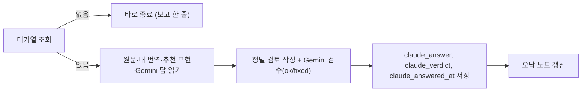

# Claude 정밀 검토 루틴 (하루 3번: 오전 8:5x · 오후 12:5x · 밤 8:5x, 한국 시간)

앱에서 🔍 **Claude 정밀 검토**를 누른 요청에 Claude가 답을 달아요. 희주 님이 Claude Code에서 "피드백 확인해줘"라고 할 때도 똑같이 이 문서를 따라요.

- Supabase 프로젝트: `djhrnlatrtrfmmcjekqk` (Supabase 커넥터의 `execute_sql`)
- 한글 톤: [`notes/style/korean-voice.md`](../style/korean-voice.md). 설명은 해요체.
- 답을 쓰면(`claude_answered_at` 채움) DB 트리거가 요청한 사람에게 휴대폰 알림을 보내요. 따로 알림을 보낼 필요는 없어요.



## 1. 대기열
```sql
select f.id, f.target_type, f.target_id, m.display_name who, f.author,
  coalesce(d.dir, s.dir) dir, coalesce(d.context, s.title) ctx, coalesce(d.source, s.source) source,
  coalesce(a.body, v.body) mine, coalesce(dm.best, sm.best) model_best, coalesce(dm.notes, sm.notes) model_notes,
  f.answer gemini_answer, f.error gemini_error
from feedback_requests f
join members m on m.email = f.author
left join drills d on f.target_type='drill' and d.id=f.target_id
left join drill_answers a on f.target_type='drill' and a.drill_id=f.target_id and a.author=f.author
left join drill_models dm on f.target_type='drill' and dm.drill_id=f.target_id
left join sessions s on f.target_type='session' and s.id=f.target_id
left join session_versions v on f.target_type='session' and v.session_id=f.target_id and v.author=f.author
left join session_models sm on f.target_type='session' and sm.session_id=f.target_id
where (f.claude_requested_at is not null and f.claude_answered_at is null)
   or (f.answered_at is null and f.error <> '')   -- Gemini 자동 답변이 실패한 요청도 처리
order by f.created_at;
```
- [ ] 결과가 없으면 "대기 중인 요청 없음" 한 줄로 끝내요. 아무것도 쓰지 않아요.

## 2. 요청마다 쓰기
- [ ] **정밀 검토**(`claude_answer`, 10줄 이내, 해요체, 마크다운 기호 없이):
  1. 잘한 점 한 줄
  2. 틀리거나 어색한 곳: "내가 쓴 표현 → 더 나은 표현"과 이유. 격(구어·문어·카피·기사체)과 뉘앙스까지
  3. 더 나은 전체 번역 한 줄 (추천 표현과 달라도 되면 그렇다고 말해요)
  4. 다음에 써먹을 팁 한 줄
- [ ] **Gemini 검수**(`claude_verdict`): Gemini 답(`gemini_answer`)이 있으면 읽고 판단해요.
  - 맞으면 `ok`
  - 틀린 설명이 있으면 `fixed`. 정밀 검토 첫 줄에 "Gemini 설명 중 ○○는 틀렸어요: …"로 바로잡아요.
  - Gemini 답이 없으면 빈 값('')
- [ ] 저장 (작은따옴표는 `''`):
```sql
update feedback_requests set claude_answer = '...', claude_verdict = 'ok', claude_answered_at = now(),
  claude_requested_at = coalesce(claude_requested_at, now())
where id = '...';
```
- [ ] Gemini가 실패해서 `answer`가 비어 있던 요청이면 위 저장만으로 충분해요(화면에 Claude 정밀 검토로 보여요).
- [ ] **오답 노트**: 반복될 만한 실수는 `mistake_notes`에 넣어요. 같은 사람의 같은 `wrong`(대소문자·공백 무시)이 있으면 `count = count + 1, last_seen = current_date`만 올려요.
```sql
insert into mistake_notes (author, lang, wrong, better, why) values ('<email>', 'en', '...', '...', '...');
```

## 3. 보고
- [ ] 한국어로 짧게: 처리한 요청 수, 사람별 요약, Gemini 검수 결과(ok/fixed 개수).
- 실패하면 반쯤 쓰지 말고, 무엇이 실패했는지 보고해요.
