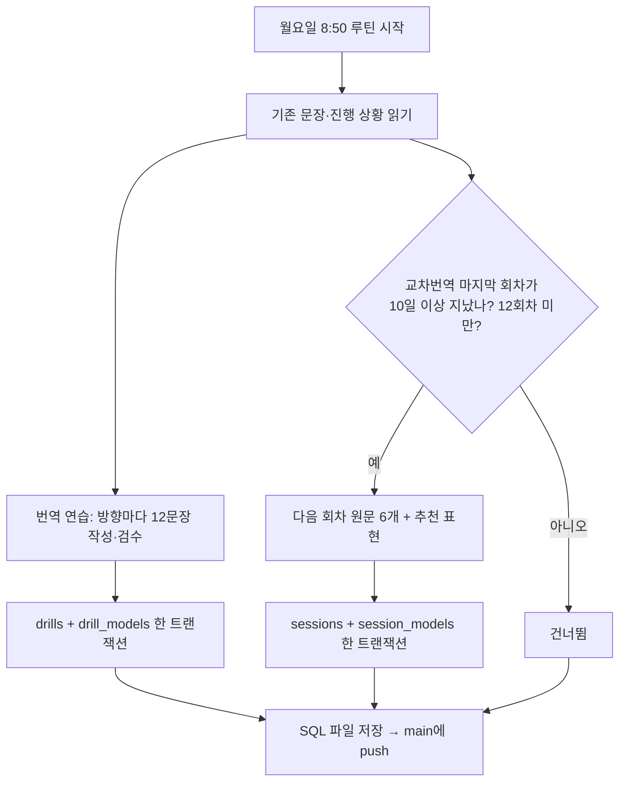

# 주간 콘텐츠 추가 루틴 (Claude가 매주 월요일 오전 8:50에 실행)

Claude Code 루틴이 이 문서를 읽고 그대로 실행해요. 사람이 고치고 싶으면 이 파일을 고치면 돼요(다음 실행부터 반영).

- Supabase 프로젝트: `djhrnlatrtrfmmcjekqk` (Supabase 커넥터의 `execute_sql` 사용)
- 앱은 AI를 부르지 않아요. 문장과 추천 표현은 Claude가 직접 쓰고 검수해서 넣어요.
- 새 문장·원문이 DB에 들어가면 트리거가 두 사람에게 휴대폰 알림을 보내요. 그래서 **문장과 추천 표현을 한 트랜잭션으로** 넣어야 해요(알림을 받고 열었는데 추천 표현이 없는 일이 없게).



## 1. 읽기
- [ ] `select id, dir, topic, context, source from drills order by created_at;` 로 기존 문장을 모두 읽어요. 같은 표현·같은 상황을 다시 쓰지 않아요.
- [ ] `select m.display_name, d.dir, count(a.*) from members m cross join (select distinct dir from drills) d left join drill_answers a on a.author=m.email and a.drill_id in (select id from drills where dir=d.dir) group by 1,2;` 로 진행 상황을 봐요(보고에만 써요).
- [ ] `select no, level, dir, title, created_at from sessions order by no desc, created_at desc;` 로 교차번역 마지막 회차와 날짜를 봐요.

> **한글 톤은 [`notes/style/korean-voice.md`](../style/korean-voice.md)를 따라요.** 마케팅은 세련된 브랜드 카피(상투어·재촉·최상급 금지), 비즈니스는 깔끔하게, 일상은 요즘 구어, 안내문은 실제 안내문 말투. 번역투(~을 통해, ~에 대한)는 빼요.

## 2. 번역 연습 (매주)
방향마다 12문장, 주제(`marketing`, `business`, `daily`, `travel`)마다 3문장씩, 모두 24문장.

| 방향 | 원문 | 추천 표현 | 누구 기본 |
|---|---|---|---|
| `KR→EN` | 자연스러운 한국어 | 영어 | 희주 |
| `EN→KR` | 자연스러운 영어 | 한국어 | 혜림 |

- 원문은 1~2문장, 실제로 쓸 법한 상황(`context`에 한 줄로: 예 "호텔 체크인 안내", "거래처 회신 메일 마무리").
- 직역하면 어색해지는 포인트(관용 표현, 격, 어순, 주어 생략, 번역투)가 하나 이상 들어가게 골라요. 쉬운 문장과 조금 어려운 문장을 섞어요.
- 추천 표현: `best` 1개, `alternatives` 2개, `notes` 2~3개(`phrase`, `why`: 직역하면 왜 어색한지, 격이 어떻게 다른지). 설명은 해요체.
- 실존 회사·인물·통계·시사 사실은 쓰지 않아요(틀릴 수 있어서).
- **검수**: 넣기 전에 문장마다 다시 읽고 확인해요. 영어는 원어민이 실제로 쓰는 말인지, 관용 표현의 뜻이 맞는지, 한국어는 번역투 없이 자연스러운지, 맞춤법과 띄어쓰기가 맞는지. 확신이 없는 관용 표현은 웹 검색으로 확인하거나 다른 표현으로 바꿔요.
- id: `dr-YYYYMMDD-ke-m1`(한→영 마케팅 1), `dr-YYYYMMDD-ek-t3`(영→한 여행 3)처럼 날짜(한국 시간)·방향·주제·번호. `sort`는 주제 안에서 1~3.

```sql
begin;
insert into public.drills (id, dir, topic, sort, context, source) values
  ('dr-20261005-ke-m1','KR→EN','marketing',1,'상황','원문'),
  ...;  -- 24문장을 한 문장(statement)으로. 알림이 한 번만 가요.
insert into public.drill_models (drill_id, best, alternatives, notes) values
  ('dr-20261005-ke-m1','best','["alt1","alt2"]','[{"phrase":"...","why":"..."}]'),
  ...;
commit;
```
작은따옴표는 `''`로 이스케이프해요.

## 3. 교차번역 (2주마다)
- [ ] 가장 큰 `no`(회차)의 원문이 **한국 시간 기준 10일 이상 전**에 올라왔고 `no < 12`일 때만 다음 회차(`no + 1`)를 추가해요. 아니면 건너뛰어요. 모임 요일이 정해지면 이 규칙을 바꿔요.
- [ ] 원문 6개: 난이도 `쉬움`·`보통`·`실전` × 방향 `KR→EN`·`EN→KR`.

| 난이도 | 기준 |
|---|---|
| 쉬움 | 1~2문장, 일상 대화·안내문 |
| 보통 | 2~3문장, 생활 기사체, 전문 용어 없음 |
| 실전 | 3문장 안팎, 기사체. 경제·사회·문화 주제. 가상의 사례로 쓰고 실제 사실처럼 쓰지 않아요 |

- 제목(`title`)은 "분류 · 주제" 형식(예: "안내문 · 헬스장 휴관", "생활 기사 · 수면").
- 추천 표현(`session_models`)도 같은 트랜잭션에 넣어요. `session_id`는 방금 넣은 행의 id를 써요(`insert ... returning id` 또는 제목으로 조회).

```sql
begin;
with s as (
  insert into public.sessions (no, dir, level, title, source) values
    (2,'KR→EN','쉬움','일상 · ...','...'),
    ... -- 6개를 한 문장으로
  returning id, title
)
insert into public.session_models (session_id, best, alternatives, notes)
select s.id, m.best, m.alternatives::jsonb, m.notes::jsonb
from s join (values ('일상 · ...','best','["..."]','[{"phrase":"...","why":"..."}]'), ...) as m(title,best,alternatives,notes)
  on m.title = s.title;
commit;
```

## 4. 기록과 보고
- [ ] 넣은 SQL을 `supabase/data/YYYYMMDD_weekly_content.sql`로 저장하고 `main`에 커밋·push해요(커밋 메시지: `Weekly content YYYY-MM-DD: 24 drills (+ session N)`).
- [ ] 확인 쿼리: 새 id의 `drills`·`drill_models` 개수가 각각 24인지, 교차번역을 넣었으면 `sessions`·`session_models`가 6인지.
- [ ] 마지막에 한국어로 짧게 보고해요: 넣은 개수, 교차번역 추가 여부(건너뛰었으면 이유), 두 사람의 진행 상황.
- 실패하면(커넥터 오류 등) 아무것도 반쯤 넣지 말고(트랜잭션 롤백) 무엇이 실패했는지 보고해요.
